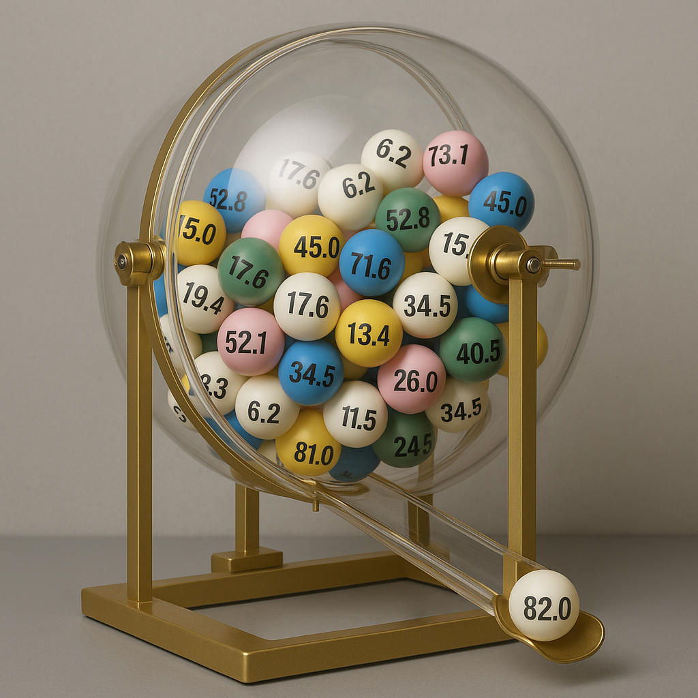

# Derivatives {#sec-derivatives}

```{r setup_derivs} 
#| message: false
library("tidyverse")
library("cowplot")
library("dataverse")
library("gganimate")
library("ggrepel")
library("gifski")
theme_set(theme_cowplot())
```

```{r get_pres_data} 
#| message: false
#| cache: true
df_pres_county <- get_dataframe_by_name(
  filename = "countypres_2000-2024.tab",
  dataset = "10.7910/DVN/VOQCHQ",
  server = "dataverse.harvard.edu",
  version = "15.0"
)
```

```{python}
# Set up concept dictionary
concepts = {}
```

## Motivation: A statistical guessing game

```{r} 
#| message: false
#| warning: false
df_pres_county <- df_pres_county |>
  filter(
    year == 2024,
    party %in% c("DEMOCRAT", "REPUBLICAN")
  ) |>
  group_by(state, county_name) |>
  summarize(
    votes_trump = sum(candidatevotes[party == "REPUBLICAN"]),
    votes_total = sum(candidatevotes),
    .groups = "drop"
  ) |>
  mutate(pct_trump = 100 * votes_trump / votes_total) |>
  mutate(winnings_70 = 10000 - (pct_trump - 70)^2)
med_trump <- median(df_pres_county$pct_trump)
avg_trump <- mean(df_pres_county$pct_trump)
```

{width="50%" fig-align="center"}

Let's imagine a tweak on a traditional lottery.
We fill the lottery drum with $N$ balls, each of which is labeled with a real number between 0 and 100.
You get to look at all of the labels, then you pick a number.
We spin the drum and choose a single lottery ball at random.
The most you can win --- if you guessed the number exactly --- is \$10,000.
If your guess wasn't exact, your winnings are reduced by the square of the difference between your guess and the number that was drawn.
For example, if you guessed 40 and the ball that was drawn said 52, meaning you were off by 12, you'd get \$9,856: $$10{,}000 - 12^2 = 10{,}000 - 144 = 9{,}856.$$

To give this game a political twist, let's assume there's one ball for every county in the United States, and each ball is labeled with Donald Trump's two-party vote percentage in that county in the 2024 presidential election.
@fig-trump-pct illustrates the distribution of labels on the lottery balls.
The distribution is left-skewed: the mean value, `r round(avg_trump, 1)`, is slightly less than the median, `r round(med_trump, 1)`.

```{r}
#| label: fig-trump-pct
df_pres_county |>
  ggplot(aes(x = pct_trump)) +
  geom_histogram(binwidth = 2.5, fill = "gray75") +
  geom_vline(xintercept = med_trump, linetype = "dashed", color = "red", linewidth = 1) +
  geom_vline(xintercept = avg_trump, linetype = "dotted", color = "blue", linewidth = 1) +
  annotate("text", x = med_trump, y = 50, color = "red", label = "median", hjust = -0.1) +
  annotate("text", x = avg_trump, y = 50, color = "blue", label = "mean", hjust = 1.1) +
  labs(
    title = "2024 presidential election results across US counties",
    subtitle = str_c("Number of counties in data: ", nrow(df_pres_county)),
    x = "Donald Trump's two-party vote percentage",
    y = "Number of counties"
  )
```

Let's calculate how much we could expect to win from the lottery if we were to make a guess of 70.
For each of the 3,188 balls in the lottery drum, we can calculate how much we would win if that ball happened to be the one that were drawn.
For example, Trump's worst county in the data, unsurprisingly, is the District of Columbia, where he got just 6.7% of the two-party vote.
If we guessed 70 and happened to draw the DC ball, we would be off by `r 70 - 6.7`, leaving us with winnings of \$`r round(10000 - (70 - 6.7)^2, 2)`.
Repeating this process for each ball in the lottery drum, @fig-lottery-winnings-median illustrates the distribution of how much we would win for each ball that could be drawn.

```{r}
#| label: fig-lottery-winnings-median
df_pres_county |>
  ggplot(aes(x = winnings_70)) +
  geom_histogram(binwidth = 100, fill = "gray75") +
  geom_vline(xintercept = mean(df_pres_county$winnings_70), linetype = "dotted", color = "blue", linewidth = 1) +
  annotate("text", x = mean(df_pres_county$winnings_70), y = 500, color = "blue", label = "mean", hjust = 1.1) +
  labs(
    title = "Potential lottery winnings with a guess of 70",
    x = "Amount won",
    y = "Number of counties"
  )
```

With a guess of 70, on average we win \$`r round(mean(df_pres_county$winnings_70), 2)`.
That sounds pretty good, but can we do even better?

Our goal is to figure out which lottery guess will give us the highest winnings on average.
Let's use a bit of mathematical notation to describe this problem as precisely as possible.
We'll use the index $i$ to represent each lottery ball, so $i$ will range from 1 to $N$ (`r nrow(df_pres_county)`).
We'll also use the notation $x_i$ to stand for the label on the $i$'th ball, and $g$ to stand for our guess.
Finally, we'll let $W(g)$ be the function (see @sec-functions) that returns our expected winnings given a guess of $g$:
$$
\begin{aligned}
W(g) &= \frac{1}{3188} \cdot [10000 - (6.7 - g)^2] + \frac{1}{3188} \cdot [10000 - (11.5 - g)^2] + \cdots + \frac{1}{3188} \cdot [10000 - (96.2 - g)^2] \\
&= \frac{1}{N} \cdot [10000 - (x_1 - g)^2] + \frac{1}{N} \cdot [10000 - (x_2 - g)^2] + \cdots + \frac{1}{N} \cdot [10000 - (x_N - g)^2] \\
&= \frac{1}{N} \sum_{i = 1}^N \left[10000 - (x_i - g)^2\right].
\end{aligned}
$$
(If you're not seeing how the second line leads to the third, go back and check @nte-summation.)

Let's plug a few potential guesses into this formula to see how much we could expect to win from each one.
@fig-lottery-winnings-coarse shows how much we would win on average for a guess of 50, 55, 60, or so on, through 90.

```{r}
#| label: fig-lottery-winnings-coarse
tibble(guess = seq(50, 90, by = 5)) |>
  mutate(
    e_winnings = map_dbl(
      guess,
      \(x) mean(10000 - (df_pres_county$pct_trump - x)^2)
    )
  ) |>
  ggplot(aes(x = guess, y = e_winnings)) +
  geom_line() +
  geom_point() +
  scale_x_continuous(breaks = seq(50, 90, by = 10), minor_breaks = seq(50, 90, by = 5)) +
  labs(
    title = "Expected winnings for a range of guesses",
    x = "Guess value",
    y = "Average dollars won"
  ) +
  background_grid(minor = "x")
```

It looks like we slightly overshot with our initial guess of 70, as we would expect to win slightly more by guessing 65 instead.
But can we do even better than 65?
To check, let's narrow our focus to the 60--70 range, going in increments of 1 instead of 5.

```{r}
#| label: fig-lottery-winnings-fine
tibble(guess = seq(60, 70, by = 1)) |>
  mutate(
    e_winnings = map_dbl(
      guess,
      \(x) mean(10000 - (df_pres_county$pct_trump - x)^2)
    )
  ) |>
  ggplot(aes(x = guess, y = e_winnings)) +
  geom_line() +
  geom_point() +
  scale_x_continuous(breaks = seq(60, 70, by = 2), minor_breaks = seq(60, 70, by = 1)) +
  labs(
    title = "Expected winnings for a finer range of guesses",
    x = "Guess value",
    y = "Average dollars won"
  ) +
  background_grid(minor = "x")
```

Well, now it looks like we would slightly undershoot by guessing 65.
The best guess now appears to be about 67.
To see if we can do even better than that, let's zoom in one more time, looking at a range of guesses between 66 and 68.

```{r}
#| label: fig-lottery-winnings-extra-fine
tibble(guess = seq(66, 68, by = 0.1)) |>
  mutate(
    e_winnings = map_dbl(
      guess,
      \(x) mean(10000 - (df_pres_county$pct_trump - x)^2)
    )
  ) |>
  ggplot(aes(x = guess, y = e_winnings)) +
  geom_line() +
  geom_point() +
  scale_x_continuous(breaks = seq(66, 68, by = 0.2), minor_breaks = seq(66, 68, by = 0.1)) +
  labs(
    title = "Expected winnings for a very fine range of guesses",
    x = "Guess value",
    y = "Average dollars won"
  ) +
  background_grid(minor = "x")
```

If we're really dedicated to squeezing every cent of expected value from this lottery, it looks like we're better off guessing 67.4 than with an even 67.
Come to think of it, going back to @fig-trump-pct, wasn't 67.4 the average value of Trump's vote percentage across all the counties in our lottery drum?

Is the answer to our problem simply to guess the average of all the labels in the lottery drum?
If so, could we have figured that out without plugging all these possible guesses into the formula?
Would this same trick work if the lottery balls were labeled differently, or is it just a coincidence that the average is the best guess here?

We can answer these questions, but we'll need some new mathematical tools to do so.
These tools are known as [differential calculus]{.concept}.

```{python}
concepts.update({
  "Differential calculus": "Mathematical techniques for studying the \"rate of change\" of a function --- how quickly or slowly the function is increasing or decreasing at a particular point in its domain.",
})
```


## Limits of functions

Go back and look at the progression from @fig-lottery-winnings-coarse to @fig-lottery-winnings-extra-fine in the lottery example.
It's like we were zooming in on the domain of the function: first looking in increments of 5, then increments of 1, and finally increments of 0.1.
The closer we zoomed in, the more accurate an idea we got about the optimal guess.

- In @fig-lottery-winnings-coarse, with increments of 5, we could see that a guess of 60 was too low, but a guess of 70 was too high.

- In @fig-lottery-winnings-fine, with increments of 1, we could see that a guess of 66 was too low, but a guess of 68 was too high.

- In @fig-lottery-winnings-extra-fine, with increments of 0.1, we could see that a guess of 67.3 was too low, but a guess of 67.5 was too high.

You could imagine continuing this process for smaller and smaller increments, down to 0.01, then 0.001, and so on.
The smaller the increment that we look at, the closer we'll get to the winnings-maximizing guess.

The problem is that no matter how small an increment we check, there's always a smaller one.
Why stop at 67.4, when we haven't figured out if we could eke out a few extra cents (on average) by guessing 67.38 or 67.43?
The process never stops --- it's like [Zeno's race course paradox](https://en.wikipedia.org/wiki/Zeno's_paradoxes#Dichotomy_paradox).
In this sense, we face a problem of limits, much like we did back in our study of sequences in @sec-sequences-limits.
To solve the problem, we will need to take our notion of the limit of a sequence, and adapt it to work with functions.

### Defining the limit of a function

We'll start with something much simpler than the lottery game.
Think about the function depicted below in @fig-function-limit-ex.
At every point in the domain besides $x = 0$, we have $f(x) = 1 + 2x$.
At $x = 0$, the value of the function "jumps" up to 1.5.

```{r}
#| label: fig-function-limit-ex
tibble(
  x = seq(-1, 1, by = 0.01),
  y = if_else(x == 0, 1.5, 1 + 2 * x),
  group = case_when(
    x < 0 ~ 1,
    x == 0 ~ 2,
    x > 0 ~ 3
  )
) |>
  ggplot(aes(x = x, y = y, group = group)) +
  geom_line() +
  annotate("point", x = 0, y = 1.5) +
  annotate("point", x = 0, y = 1, shape = 21, size = 2, fill = "white") +
  labs(x = "", y = "") +
  background_grid()
```

One way to define this function formally would be using the "cases" notation with a curly brace:
$$
f(x) = \begin{cases}
1 + 2 x & \text{if $x \neq 0$}, \\
1.5 & \text{if $x = 0$}.
\end{cases}
$$

If we get really close to $x = 0$ on the domain but not quite there, the value of the function gets really close to 1.
This is true no matter how close we get, as long as we don't go all the way to $x = 0$ itself.
In this sense, we would say the [limit of the function]{.concept} as $x$ approaches 0 is equal to 1.
In mathematical notation, we would write $$\lim_{x \to 0} f(x) = 1.$$

```{python}
concepts.update({
  "Limit of a function": "The limit of $f(x)$ as $x$ approaches $c$, denoted $\\lim_{x \\to c} f(x)$, is the value that $f(x)$ gets closer and closer to as $x$ gets closer and closer to $c$ without reaching it.  The formal definition is that $\\lim_{x \\to c} f(x) = y$ if, for all $\\epsilon > 0$, there is a value $\\delta > 0$ such that $|f(x) - y| < \\epsilon$ for all $x \\in (c - \\delta, c) \\cup (c, c + \\delta)$.  A function may not have a limit at a particular point.",
})
```

The problem with this kind of limiting statement is that we end up in an infinite regress.
However close to $x = 0$ we look, we can always look a little bit closer --- so how do we ever get close enough to say for certain what the limit is?
Back in our formal definition of a limit for a sequence (@def-limit), we used a "challenge-response" structure to escape the infinite regress.
We will use a similar challenge-response method to define the limit of a function.
Suppose I have a function $f$, and I want to claim that $\lim_{x \to c} f(x) = y$, i.e., the limit of the function as $x$ approaches the point $c$ in its domain is equal to $y$.

1. You **challenge** me by picking a $\epsilon > 0$.

   Think of this as you saying "I need you to show me that if we are close enough to $x = c$ on the domain of the function, then the value of $f(x)$ is within $\epsilon$ of your claimed limit, $y$."

2. I **respond** to the challenge by identifying a value $\delta > 0$.
   I need to show you that if $0 < |x - c| < \delta$, then we have $|f(x) - y| < \epsilon$.

   In words, at any point on the domain whose distance from $c$ is less than $\delta$ (other than $c$ itself), the value of the function is at least as close to my claimed limit as you challenged me to show.

If I can conjure up a valid response to any $\epsilon > 0$ challenge that you might issue, then my claim about the limit of the function stands.
This line of reasoning gives us our formal definition of the limit of a function.

::: {#def-limit-function name="Limit of a function"}
Let $X \subseteq \mathbb{R}$ be an open interval, and consider the function $f: X \to \mathbb{R}$.
For a point $c \in X$, we say that the [limit of the function]{.concept} as $x$ approaches $c$ equals $y$, denoted $\lim_{x \to c} f(x) = y$, if the following condition holds:
for any value of $\epsilon > 0$, there exists a value $\delta > 0$ such that $|f(x) - y| < \epsilon$ for all $x$ satisfying $0 < |x - c| < \delta$.

:::: {.callout-note title="Optional technical note: Extension to general domains" collapse="true"}
I have stated the formal definition only for functions whose domain is an open interval.
Under this stipulation, the domain $X$ must take one of the four following forms:

1. $X$ is the whole real line, $X = \mathbb{R}$.

2. $X$ is the set of numbers strictly greater than some real number $a$, $X = \{x \in \mathbb{R} \mid x > a\} = (a, \infty)$.

3. $X$ is the set of numbers strictly less than some real number $b$, $X = \{x \in \mathbb{R} \mid x < b\} = (-\infty, b)$.

4. $X$ is the set of numbers strictly greater than some real number $a$ and strictly less than some real number $b$, $X = \{x \in \mathbb{R} \mid a < x < b\} = (a, b)$.

This restriction ensures that for any $c \in X$, it is possible to find a $\delta$ small enough that $(c - \delta, c + \delta) \subseteq X$, and thus the value of $f(x)$ is well-defined for all $x \in (c - \delta, c + \delta)$.

The definition of a function limit extends rather straightforwardly to cases where the domain is not an open interval, but then it requires some extra bookkeeping to deal with cases where we cannot evaluate $f(x)$ across all of $(c - \delta, c + \delta)$ even for $\delta$ arbitrarily small.
For example, think about a function whose domain is the closed interval $X = [0, 1]$, and imagine taking a limit as $x \to 1$.
No matter how small $\delta$ is, we cannot evaluate the function over $(1, 1 + \delta)$.

To skirt this problem for functions with general domains $X \subseteq \mathbb{R}$, we redefine the limit in terms of sequences.
Specifically, for a point $c \in X$, we say that $\lim_{x \to c} f(x) = y$ if the following condition holds: for every sequence $\{x_n\} \to c$ where each $x_n \in X$ and each $x_n \neq c$, we have $\{f(x_n)\} \to y$ [@rudin1976principles, Theorem 4.2].

- If the domain of the function is an open interval, this definition corresponds exactly to @def-limit-function.

- If the domain of the function is a closed interval $[a, b]$, this definition corresponds exactly to @def-limit-function for all $c \in (a, b)$.
  For the lower boundary $a$, the limit is equal to the right-hand limit (see @def-handed-limit below).
  For the upper boundary $b$, the limit is equal to the left-hand limit.
::::
:::

Like the formal definition of the limit of a sequence, this definition is probably hard to parse in purely abstract terms.
To make it make a bit more sense, let's practice using the formal definition to show that $f(x) \to 1$ as $x \to 0$ for the function illustrated in @fig-function-limit-ex.

::: {#exm-function-limit name="Using the formal definition of a function limit"}
We are working with the function depicted in @fig-function-limit-ex, namely
$$
f(x) = \begin{cases}
  1 + 2x & \text{if $x \neq 0$}, \\
  1.5 & \text{if $x = 0$}.
\end{cases}
$$
It seems clear from the illustration that $\lim_{x \to 0} f(x) = 1$, but how can we show this formally using @def-limit-function?

We'll start by considering any "challenge" $\epsilon > 0$.
This is akin to someone telling us: you need to show that if $x$ is close enough to $0$, then $f(x)$ is within $\epsilon$ of the claimed limit, namely $1$.
Because we want to show that we can meet any such challenge, we are not going to put a specific value on $\epsilon$.
Instead, we'll show that for an arbitrary value of $\epsilon > 0$ --- a value that we know nothing about, other than the fact that it's a positive number --- we can find a $\delta$ that satisfies the challenge.

Our response to the challenge will be $\delta = \epsilon / 2$.
We need to show that if $0 < |x - 0| < \delta$, then $|f(x) - 1| < \epsilon$.
Equivalently, we need to show that if $x \in (-\delta, 0) \cup (0, \delta)$, then $-\epsilon < f(x) - 1 < \epsilon$.
We'll do this in two parts.

1. For all $x \in (-\delta, 0)$, we have $$f(x) = 1 + 2x > 1 + 2(-\delta) = 1 + 2\left(-\frac{\epsilon}{2}\right) = 1 - \epsilon$$ and $$f(x) = 1 + 2x < 1 + 2(0) = 1.$$
   Therefore, for all such $x$, we have $-\epsilon < f(x) - 1 < 0 < \epsilon$, as required.

2. For all $x \in (0, \delta)$, we have $$f(x) = 1 + 2x > 1 + 2(0) = 1$$ and $$f(x) = 1 + 2x < 1 + 2\delta = 1 + 2\left(\frac{\epsilon}{2}\right) = 1 + \epsilon.$$
   Therefore, for all such $x$, we have $-\epsilon < 0 < f(x) - 1 < \epsilon$, as required.

We have shown that for any challenge $\epsilon > 0$ to our claim that $\lim_{x \to 0} f(x) = 1$, we have a valid response, namely $\delta = \epsilon/2$.
Therefore, we have proved that $\lim_{x \to 0} f(x) = 1$.
:::

The next exercise asks you to generalize the logic of this example to all functions that are linear everywhere except (perhaps) a single point.

::: {#exr-limit-linear name="Limit of a linear function"}
Let $c$, $\alpha$, and $\beta$ be real numbers.
Let $f : \mathbb{R} \to \mathbb{R}$ be a function such that $f(x) = \alpha + \beta x$ for all $x \neq c$.
Prove that $\lim_{x \to c} f(x) = \alpha + \beta c$.

:::: {.callout-note title="Answer" collapse="true"}
First consider the case where $\beta \neq 0$.
The problem is then analogous to @exm-function-limit, and our approach will be analogous.
Consider any challenge $\epsilon > 0$.
I claim that $\delta = \epsilon / |\beta|$ is a valid response.
For all $x$ satisfying $0 < |x - c| < \delta$, we have
$$
\begin{aligned}
|f(x) - (\alpha + \beta c)|
&= |(\alpha + \beta x) - (\alpha + \beta c)| \\
&= |\alpha + \beta x - \alpha - \beta c| \\
&= |\beta x - \beta c| \\
&= |\beta (x - c)| \\
&= |\beta| \cdot |x - c| \\
&< |\beta| \cdot \delta \\
&= |\beta| \cdot \frac{\epsilon}{|\beta|} \\
&= \epsilon,
\end{aligned}
$$
so $\delta$ is a valid response to the challenge.
Because $\epsilon$ was chosen arbitrarily, this proves that $\lim_{x \to c} f(x) = \alpha + \beta c$.

The approach in the previous paragraph does not quite work when $\beta = 0$, as then we cannot divide by $\beta$ when choosing our $\delta$ response.
In this case, however, our problem is even simpler, as the function is constant: $f(x) = \alpha$ for all $x \neq c$.
Consider any challenge $\epsilon > 0$.
I claim that any $\delta > 0$ is a valid response.
For all $x$ satisfying $0 < |x - c| < \delta$, we have
$$
|f(x) - \alpha| = |\alpha - \alpha| = 0 < \epsilon,
$$
so $\delta$ is a valid response to the challenge.
Because $\epsilon$ was chosen arbitrarily, this proves that $\lim_{x \to c} f(x) = \alpha = \alpha + \beta c$ when $\beta = 0$.
::::
:::

Just as with the limits of sequences, a function can have at most one limit at a particular point in its domain.
And just as with the limits of sequences, there is no guarantee that $\lim_{x \to c} f(x)$ exists.
As a simple example of a non-existent limit, think about the point $x = 0$ in the "step function"
$$
f(x) = \begin{cases}
0 & \text{if $x < 0$}, \\
1 & \text{if $x \geq 0$},
\end{cases}
$$
which is illustrated below in @fig-step-function.

```{r}
#| label: fig-step-function
tibble(x = seq(-1, 1, by = 0.01), y = if_else(x < 0, 0, 1)) |>
  ggplot(aes(x = x, y = y, group = x < 0)) +
  geom_line() +
  annotate("point", x = 0, y = 0, shape = 21, fill = "white", size = 2) +
  annotate("point", x = 0, y = 1, shape = 21, fill = "black", size = 2) +
  labs(x = "", y = "", title = "A step function")
```

Let's use @def-limit-function to work through why the step function doesn't have a limit at $x = 0$.

::: {.aside}
Remember that $\lim_{x \to c} f(x) = y$ if for [any]{.underline} $\epsilon > 0$ challenge, there is [at least one]{.underline} valid $\delta > 0$ response.
We have to be careful how we reverse these quantifiers when we try to show that $\lim_{x \to c} f(x) \neq y$.
It is sufficient to find a single challenge that cannot be answered.
Specifically, we have to show that there is [at least one]{.underline} $\epsilon > 0$ challenge for which there is [not any]{.underline} valid $\delta > 0$ response.
:::

- First, we can rule out any limit other than 0.
  Take any $y \neq 0$.
  To rule out $\lim_{x \to 0} f(x) = y$, we need to show that there is an $\epsilon$ challenge that cannot be answered.
  
  I claim that there is no valid answer to the $\epsilon = |y|/2$ challenge.
  I must show that for all $\delta > 0$, I can find an $x$ that satisfies $0 < |x - 0| < \delta$ for which $|f(x) - y| \geq |y|/2$.
  To this end, take an arbitrary $\delta > 0$, and consider $x = -\delta/2$.
  We have $0 < |0 - (-\delta/2)| = \delta/2 < \delta$ as required, and yet $|f(x) - y| = |0 - y| = |y| > |y| / 2$.
  Therefore, the challenge cannot be answered, and thus $y$ cannot be the limit of $f(x)$ as $x$ approaches 0.

- To conclude that there is no limit at $x = 0$, it will now suffice to show that 0 cannot be the limit either.

  I claim that there is no valid answer to the $\epsilon = 1/2$ challenge to the claim that $\lim_{x \to 0} f(x) = 0.$
  To this end, take an arbitrary $\delta > 0$, and consider $x = \delta/2$.
  We have $0 < |0 - \delta/2| = \delta/2 < \delta$ as required, and yet $|f(x) - 0| = |1 - 0| = 1 > 1/2$.
  Therefore, the challenge cannot be answered, and thus $0$ cannot be the limit of $f(x)$ as $x$ approaches 0.

The key problem in @fig-step-function is that the behavior of the function as we approach $x = 0$ is different when we are approach from the left (values below $x = 0$) than when we approach from the right (values above $x = 0$).
By the same token, though, it seems sensible to say that the limit of the function is 0 as we approach $x = 0$ from the left, and that the limit is 1 as we approach from the right.
Indeed, it is sensible.
We would say that the function's [left-hand limit]{.concept} at $x = 0$ is 0 and that its [right-hand limit]{.concept} at $x = 0$ is 1.

```{python}
concepts.update({
  "Left- and right-handed limits": "The left-handed limit is the value that $f(x)$ gets closer and closer to as $x$ gets closer and closer to $c$ without meeting or exceeding it.  The right-handed limit is the same thing, from the opposite direction.",
})
```

::: {#def-handed-limit name="Left- and right-hand limits"}
Let $X \subseteq \mathbb{R}$ be an open interval, and consider the function $f : X \to \mathbb{R}$.

For a point $c \in X$, we say that the limit of $f(x)$ as $x$ approaches $c$ [from the left]{.concept} equals $y$, denoted $\lim_{x \to c^-} f(x) = y$, if the following condition holds: for any value of $\epsilon > 0$, there exists a value $\delta > 0$ such that $|f(x) - y| < \epsilon$ for all $x \in (c - \delta, c)$.

Similarly, we say that the limit of $f(x)$ as $x$ approaches $c$ [from the right]{.concept} equals $y$, denoted $\lim_{x \to c^+} f(x) = y$, if the following condition holds: for any value of $\epsilon > 0$, there exists a value $\delta > 0$ such that $|f(x) - y| < \epsilon$ for all $x \in (c, c + \delta)$.

:::: {.callout-note title="Optional technical note: Extension to general domains" collapse="true"}
As in @def-limit-function, I have stated the formal definition only for functions whose domain is an open interval.
Here are the definitions for general domains $X \subseteq \mathbb{R}$:

- $\lim_{x \to c^-} f(x) = y$ if for every sequence $\{x_n\} \to c$ where each $x_n \in X$ and each $x_n < c$, we have $\{f(x_n)\} \to y$.

- $\lim_{x \to c^+} f(x) = y$ if for every sequence $\{x_n\} \to c$ where each $x_n \in X$ and each $x_n > c$, we have $\{f(x_n)\} \to y$.
::::
:::

The formal definition of left- and right-hand limits has the same challenge-response structure as the definition of the ordinary limit.
The only difference is how much ground our response needs to cover.
For the ordinary limit, we have to show that the function value is close enough to the claimed limit within a small enough window both below and above $c$.
The left-hand limit requires us only to do this for a small enough window below, and the right-hand limit requires only a small enough window above.

To practice this definition, you should work through proving that at $x = 0$, the left-hand limit of the step function is 0 and the right-hand limit is 1.

::: {#exr-step-function-limits}
For the step function illustrated in @fig-step-function, use @def-handed-limit to prove that $\lim_{x \to 0^-} f(x) = 0$ and that $\lim_{x \to 0^+} f(x) = 1$.

*(If you're not seeing how to work through this one, check the answer to the left-hand limit first, then use that answer as a template to prove the right-hand limit.)*

:::: {.callout-note title="Answer: left-hand" collapse="true"}
I want to show that $\lim_{x \to 0^-} f(x) = 0$.
To this end, consider any challenge $\epsilon > 0$.
I claim that $\delta = 1$ is a valid response to the challenge.
For all $x \in (-1, 0)$, we have $$|f(x) - 0| = |0 - 0| = 0 < \epsilon,$$ so the response to the challenge is indeed valid.
Because $\epsilon$ was chosen arbitrarily, this proves that $\lim_{x \to 0^-} f(x) = 0$.
::::

:::: {.callout-note title="Answer: right-hand" collapse="true"}
I want to show that $\lim_{x \to 0^+} f(x) = 1$.
To this end, consider any challenge $\epsilon > 0$.
I claim that $\delta = 1$ is a valid response to the challenge.
For all $x \in (0, 1)$, we have $$|f(x) - 1| = |1 - 1| = 0 < \epsilon,$$ so the response to the challenge is indeed valid.
Because $\epsilon$ was chosen arbitrarily, this proves that $\lim_{x \to 0^+} f(x) = 1$.
::::
:::

Much like the ordinary limit, the left- and right-hand limits are not guaranteed to exist.
However, it's pretty rare to run into a function in political science or statistics where the one-sided limits don't exist.
The typical example of such a function would be something that oscillates more and more wildly as it approaches a single point (e.g., the limit of $\sin (1/x)$ as $x \to 0$ from the right), but these kinds of functions don't arise naturally for the kinds of problems we work on.

In @fig-step-function, we saw an example of why the ordinary limit doesn't exist if the left- and right-handed limits don't agree with each other.
The converse is also true: if the ordinary limit exists, then the left- and right-hand limits both exist, with the same value as the ordinary limit.
Therefore, existence of the ordinary limit is logically equivalent (see @sec-prove-equivalence) to existence and agreement of the one-sided limits.

::: {#prp-handed-limits-equal}
Let $X \subseteq \mathbb{R}$ be an open interval, and consider the function $f : X \to \mathbb{R}$ and the point $c \in X$.
We have $\lim_{x \to c} f(x) = y$ if and only if $$\lim_{x \to c^-} f(x) = \lim_{x \to c^+} f(x) = y.$$
:::

::: {.proof}
To prove the "only if" direction, suppose $\lim_{x \to c} f(x) = y$.
Take any $\epsilon > 0$.
Because $\lim_{x \to c} f(x) = y$, there exists a $\delta > 0$ such that $|f(x) - y| < \epsilon$ for all $x$ satisfying $0 < |x - c| < \delta$.
It follows immediately that $|f(x) - y| < \epsilon$ for all $x \in (c - \delta, c)$ and that $|f(x) - y| < \epsilon$ for all $x \in (c, c + \delta)$.
Therefore, $\delta$ is a valid response for the $\epsilon$ challenge to the claim that $\lim_{x \to c^-} f(x) = y$ as well as the $\epsilon$ challenge to the claim that $\lim_{x \to c^+} f(x) = y.$
As $\epsilon$ was chosen arbitrarily, this proves that $\lim_{x \to c^-} f(x) = y$ and that $\lim_{x \to c^+} f(x) = y.$

To prove the "if" direction, suppose $\lim_{x \to c^-} f(x) = \lim_{x \to c^+} f(x) = y$.
Consider any $\epsilon > 0$ challenge to the claim that $\lim_{x \to c} f(x) = y$.

- Because $\lim_{x \to c^-} f(x) = y$, there exists a $\delta_1 > 0$ such that $|f(x) - y| < \epsilon$ for all $x \in (c - \delta_1, c)$.

- Because $\lim_{x \to c^+} f(x) = y$, there exists a $\delta_2 > 0$ such that $|f(x) - y| < \epsilon$ for all $x \in (c, c + \delta_2)$.

Let $\delta$ be the smaller of these values: $\delta = \min \{\delta_1, \delta_2\}$.
Then for all $x$ satisfying $0 < |x - c| < \delta$, we have either $x \in (c - \delta_1, c)$ or $x \in (c, c + \delta_2)$, which implies $|f(x) - y| < \epsilon$.
Therefore, $\delta$ is a valid response for the $\epsilon$ challenge.
As $\epsilon$ was chosen arbitrarily, this proves that $\lim_{x \to c} f(x) = y$.
:::

If you're like me, you don't want to have to use the formal definition of a function limit any more often than you absolutely have to.
Luckily, just as we saw for the limits of sequences (@prp-limit-properties), the limits of functions behave predictably when we use arithmetic operations like addition and multiplication.

::: {#prp-function-limit-properties title="Arithmetic properties of function limits"}
Let $X$ be a set of real numbers, and let $f : X \to \mathbb{R}$ and $g : X \to \mathbb{R}$ be functions.
Suppose there is a point $c \in X$ such that $\lim_{x \to c} f(x)$ and $\lim_{x \to c} g(x)$ both exist.

1. For any constant $m$, $\lim_{x \to c} m \cdot f(x) = m \cdot \lim_{x \to c} f(x).$

2. $\lim_{x \to c} [f(x) + g(x)] = \lim_{x \to c} f(x) + \lim_{x \to c} g(x).$

3. $\lim_{x \to c} [f(x) - g(x)] = \lim_{x \to c} f(x) - \lim_{x \to c} g(x).$

4. $\lim_{x \to c} [f(x) \cdot g(x)] = \left(\lim_{x \to c} f(x)\right) \cdot \left(\lim_{x \to c} g(x)\right).$

5. If $\lim_{x \to c} g(x) \neq 0$, then $\lim_{x \to c} \frac{f(x)}{g(x)} = \frac{\lim_{x \to c} f(x)}{\lim_{x \to c} g(x)}.$

These claims remain true if all limits are replaced with left-hand limits, or if all limits are replaced with right-hand limits.
:::

::: {.proof}
Because limits can be defined in terms of convergent sequences (see the technical notes to @def-limit-function and @def-handed-limit), each claim follows from @prp-limit-properties.
:::

The next few exercises have you get some practice with these helpful properties.

::: {#exr-sum-of-function-limits}
Let $X$ be a set of real numbers, and for each $i = 1, \ldots, N$, let $f_i : X \to \mathbb{R}$ be a function.
Suppose there is a point $c \in X$ such that $\lim_{x \to c} f_i(x)$ exists for all $i = 1, \ldots, N$.
Use a proof by induction (see @sec-proof-by-induction) to prove that $$\lim_{x \to c} \left[\sum_{i=1}^N f_i(x)\right] = \sum_{i=1}^N \lim_{x \to c} f_i(x).$$

:::: {.callout-note title="Answer" collapse="true"}
To prove the base step, we must prove that the claim is true when $N = 1$.
To this end, observe that $$\lim_{x \to c} \left[\sum_{i=1}^1 f_i(x)\right] = \lim_{x \to c} f_1(x) = \sum_{i=1}^1 \lim_{x \to c} f_i(x).$$

To prove the induction, we must show that if the claim is true for $N = k$, then it is also true for $N = k + 1$.
To this end, assume that the claim is true for $N = k$, so that $$\lim_{x \to c} \left[\sum_{i=1}^k f_i(x)\right] = \sum_{i=1}^k \lim_{x \to c} f_i(x).$$
By part 2 of @prp-function-limit-properties, we have
$$
\begin{aligned}
\lim_{x \to c} \left[\sum_{i=1}^{k+1} f_i(x)\right]
&= \lim_{x \to c} \left[\left(\sum_{i=1}^k f_i(x)\right) + f_{k+1}(x)\right] \\
&= \lim_{x \to c} \left[\sum_{i=1}^k f_i(x)\right] + \lim_{x \to c} f_{k+1}(x) \\
&= \left(\sum_{i=1}^k \lim_{x \to c} f_i(x)\right) + \lim_{x \to c} f_{k+1}(x) \\
&= \sum_{i=1}^{k+1} \lim_{x \to c} f_i(x),
\end{aligned}
$$
which proves the induction step.
::::
:::

::: {#exr-lottery-limit}
Consider the function that maps the lottery guess into expected winnings in our motivating example, $$W(g) = \frac{1}{N} \sum_{i=1}^N [10000 - (x_i - g)^2].$$
Using @prp-function-limit-properties and the claims proved in @exr-limit-linear and @exr-sum-of-function-limits, prove that $$\lim_{h \to 0} W(g + h) = W(g).$$

:::: {.callout-note title="Answer" collapse="true"}
By part 1 of @prp-function-limit-properties, we have
$$
\begin{aligned}
\lim_{h \to 0} W(g + h)
&= \lim_{h \to 0} \left\{\frac{1}{N} \sum_{i=1}^N [10000 - (x_i - (g + h))^2]\right\} \\
&= \frac{1}{N} \lim_{h \to 0} \left\{\sum_{i=1}^N [10000 - (x_i - (g + h))^2] \right\}.
\end{aligned}
$$
By the claim proved in @exr-sum-of-function-limits, we have
$$
\frac{1}{N} \lim_{h \to 0} \left\{\sum_{i=1}^N [10000 - (x_i - (g + h))^2] \right\}
= \frac{1}{N} \sum_{i=1}^N \lim_{h \to 0} [10000 - (x_i - (g + h))^2]
$$
By the claim proved in @exr-limit-linear (specifically the $\beta = 0$ case for a constant function), we have $\lim_{h \to 0} 10000 = 10000$.
Then, by part 2 of @prp-function-limit-properties, we have
$$
\frac{1}{N} \sum_{i=1}^N \lim_{h \to 0} [10000 - (x_i - (g + h))^2]
= \frac{1}{N} \sum_{i=1}^N \left\{10000 - \lim_{h \to 0} \left[(x_i - (g + h))^2\right]\right\}.
$$
Part 4 of @prp-function-limit-properties gives us
$$
\begin{aligned}
\frac{1}{N} \sum_{i=1}^N \left\{10000 - \lim_{h \to 0} \left[(x_i - (g + h))^2\right]\right\}
&= \frac{1}{N} \sum_{i=1}^N \left\{10000 - \left(\lim_{h \to 0} [x_i - (g + h)]\right)^2\right\} \\
&= \frac{1}{N} \sum_{i=1}^N \left\{10000 - \left(\lim_{h \to 0} [x_i - g - h]\right)^2\right\}.
\end{aligned}
$$
Part 3 of @prp-function-limit-properties and @exr-limit-linear then give us
$$
\begin{aligned}
\frac{1}{N} \sum_{i=1}^N \left\{10000 - \left(\lim_{h \to 0} [x_i - g - h]\right)^2\right\}
&= \frac{1}{N} \sum_{i=1}^N \left\{10000 - \left(\lim_{h \to 0} [x_i - g] - \lim_{h \to 0} h\right)^2\right\} \\
&= \frac{1}{N} \sum_{i=1}^N \left[10000 - \left([x_i - g] - 0\right)^2\right] \\
&= \frac{1}{N} \sum_{i=1}^N \left[10000 - (x_i - g)^2\right] \\
&= W(g).
\end{aligned}
$$
We conclude that $\lim_{h \to 0} W(g + h) = W(g)$, as claimed.
::::
:::

::: {#exr-limit-ratio}
Find the value of $$\lim_{x \to -1} \frac{x^2 - 1}{x + 1},$$ or explain why it does not exist.

:::: {.callout-note title="Answer" collapse="true"}
This is a bit of a trick question.
(Sorry.)
Because the denominator approaches zero as $x \to -1$, we cannot use part 5 of @prp-function-limit-properties here.
Nonetheless, the limit does exist, and its value is $-2$, which you can see if you plot values of $\frac{x^2 - 1}{x + 1}$ near $x = -1$ in R.

```{r}
tibble(x = seq(-2, 0, by = 0.1)) |>
  filter(x != -1) |>
  mutate(y = (x^2 - 1) / (x + 1)) |>
  ggplot(aes(x = x, y = y)) +
  geom_point() +
  background_grid()
```

The key to the problem is that for all $x \neq -1$, we have $$\frac{x^2 - 1}{x + 1} = \frac{(x + 1) (x - 1)}{x + 1} = x - 1.$$
Since we only use values *near* $x = -1$ to calculate the limit, not the value at $x = -1$ itself (carefully parse @def-limit-function if you doubt this), we have
$$\lim_{x \to -1} \frac{x^2 - 1}{x + 1} = \lim_{x \to -1} [x - 1] = -1 - 1 = -2.$$
::::
:::

There are (at least!) two ways to think about the limit of a function $f(x)$ as $x$ approaches some point $c$.
One way is just that, as $\lim_{x \to c} f(x)$.
The other way is to think of it as the limit of $f(c + h)$ as $h$ approaches 0, or in notation as $\lim_{h \to 0} f(c + h)$, as you worked with in @exr-lottery-limit.
These two ways of thinking about a limit turn out to be equivalent, so you can use whichever one makes the most sense for the particular problem you're working on.

::: {#prp-function-limit-equivalence}
Let $X \subseteq \mathbb{R}$ be an open interval, and consider the function $f : X \to \mathbb{R}$ and the point $c \in X$.
We have $\lim_{x \to c} f(x) = y$ if and only if $\lim_{h \to 0} f(c + h) = y$.
:::

::: {.proof}
I will prove the "if" direction, and I'll leave the "only if" direction as an exercise for you.

Suppose $$\lim_{h \to 0} f(c + h) = y.$$
We want to show that this implies $\lim_{x \to c} f(x) = y.$
Specifically, we must show that for all $\epsilon > 0$, there is a $\delta > 0$ such that $|f(x) - y| < \epsilon$ for all $x$ that satisfy $0 < |x - c| < \delta$.

To this end, take any value $\epsilon > 0$.
Because $\lim_{h \to 0} f(c + h) = y$, we know that there is a value $\delta > 0$ such that $|f(c + d) - y| < \epsilon$ for all $d$ that satisfy $0 < |d| < \delta$.
Therefore, for all $x$ that satisfy $0 < |x - c| < \delta$, we have
$$
\begin{aligned}
|f(x) - y|
= |f(c + (x - c)) - y|
< \epsilon.
\end{aligned}
$$
We have thus shown that for all $\epsilon > 0$, there is a $\delta > 0$ such that $|f(x) - y| < \epsilon$ for all $x$ satisfying $0 < |x - c| < \delta$.
Consequently, $\lim_{x \to c} f(x) = y$.
:::

::: {#exr-function-limit-equivalence-only-if}
Prove the "only if" direction of @prp-function-limit-equivalence.

:::: {.callout-note title="Answer" collapse="true"}
Suppose $$\lim_{x \to c} f(x) = y.$$
We want to show that this implies $\lim_{h \to 0} f(c + h) = y.$

Take any $\epsilon > 0.$
Because $\lim_{x \to c} f(x) = y,$ there is a $\delta > 0$ such that $|f(x) - y| < \epsilon$ for all $x$ that satisfy $0 < |x - c| < \delta.$
Therefore, for all $h$ that satisfy $0 < |h| < \delta,$ we have $0 < |(c + h) - c| < \delta$ and thus $|f(c + h) - y| < \epsilon.$
Consequently, $\lim_{h \to 0} f(c + h) = y$.
::::
:::

### Continuity

You might notice a pattern in @fig-function-limit-ex and @fig-step-function.
At the points in the domain where the value of the function is not equal to its left- or right-hand limit, the graph of the function appears to "jump."
In mathematical terms, we'd say these jumps are points of discontinuity.
By contrast, in the parts of the domain where there are no such jumps, the function is [continuous]{.concept}.

```{python}
concepts.update({
  "Continuity": "A function $f : X \\to Y$ is continuous at a point in its domain, $c \\in X$, if its limit at that point exists and equals the value of the function: $\\lim_{x \\to c} f(x) = f(c)$.  We call $f$ a continuous function if it is continuous at every point in its domain.",
})
```

::: {#def-continuity-point name="Continuity at a point"}
We say that a function $f : X \to Y$ is [continuous at the point]{.concept} $c \in X$ if its limit exists at that point and is equal to the value of the function: $$\lim_{x \to c} f(x) = f(c).$$
:::

For most functions you'd deal with in practice, you can tell where the function is continuous and where it is not by looking at the graph.
At any point where the left- and right-hand limits do not agree, the function is discontinuous.
It is also discontinuous at any point where the limits agree but the function value itself "jumps."
At all other points, the function is continuous.

::: {.aside}
The "in practice" caveat here is important.
Mathematicians have discovered weird functions --- e.g., the [Dirichlet function](https://en.wikipedia.org/wiki/Dirichlet_function), the [Cantor function](https://en.wikipedia.org/wiki/Cantor_function), and the [Weierstrass function](https://en.wikipedia.org/wiki/Weierstrass_function) --- that challenge some of our visual intuitions about continuity and other mathematical properties.
However, unless you find yourself doing relatively advanced formal theory, functions like these don't really come up in political science applications.
:::

```{r}
#| label: fig-identify-discontinuity
#| fig-cap: "The function is discontinuous at $d_1$ and $d_2$, and continuous at all other points."
tibble(x = seq(0, 1, by = 0.001)) |>
  mutate(
    group = case_when(
      x < 0.3 ~ 1,
      x < 0.7 ~ 2,
      TRUE ~ 3
    ),
    y = case_when(
      group == 1 ~ 0.5 * x,
      group == 2 ~ 0.3 + x,
      group == 3 ~ 1 - (x - 0.7)
    )
  ) |>
  ggplot(aes(x = x, y = y, group = group)) +
  geom_vline(xintercept = 0.3, linetype = "dashed", color = "blue", linewidth = 0.25) +
  geom_vline(xintercept = 0.7, linetype = "dashed", color = "red", linewidth = 0.25) +
  geom_line() +
  annotate("point", x = 0.3, y = 0.15, shape = 21, fill = "white", size = 2) +
  annotate("point", x = 0.3, y = 0.6, shape = 21, fill = "black", size = 2) +
  annotate("point", x = 0.7, y = 1, shape = 21, fill = "white", size = 2) +
  annotate("point", x = 0.7, y = 1.2, shape = 21, fill = "black", size = 2) +
  annotate("text", x = 0.3, y = 0.35, label = "left + right limits disagree", hjust = -0.025, color = "blue", size = 4) +
  annotate("text", x = 0.7, y = 1.1, label = "value jumps away from limit", hjust = -0.025, color = "red", size = 4) +
  labs(
    title = "Visually identifying continuity and discontinuity points",
    x = "x",
    y = "f(x)"
  ) +
  scale_x_continuous(breaks = c(0.3, 0.7), labels = c(expression(d[1]), expression(d[2])))
```

When a function is continuous at every point in its domain, we call it a [continuous function]{.concept}.

::: {#def-continuous-function title="Continuous function"}
We say that a function $f : X \to Y$ is [continuous]{.concept} if it is continuous at every point in its domain, $X$.

Equivalently, we say that $f : X \to Y$ is continuous if for every domain point $c \in X$ and every value $\epsilon > 0$, there exists a value $\delta > 0$ such that $|f(x) - f(c)| < \epsilon$ for all $x \in (c - \delta, c + \delta)$.
:::

When a function $f$ is continuous, every point close to $c$ on the domain has a function value close to $f(c)$.
That's the plain language interpretation of the second paragraph of @def-continuous-function.
If you think about it this way, you can see why the function illustrated in @fig-identify-discontinuity is not continuous.
Even at values of $x$ really really close to $d_2$, there's going to be a substantial gap between the function values $f(x)$ and $f(d_2)$.

Lots of common functions are continuous.
Here are just a few examples of functions you're likely to run into that are continuous.
Except where I note otherwise, each of the functions $f : X \to \mathbb{R}$ below is continuous on any subset of the real numbers, $X \subseteq \mathbb{R}$.

Identity function
: The function $f(x) = x$ is continuous.

Absolute value function
: The function $f(x) = |x|$, or equivalently $$f(x) = \begin{cases}-x & \text{if $x < 0$},\\x & \text{if $x \geq 0$,}\end{cases}$$ is continuous.

Linear functions
: Any function of the form $f(x) = a + b x$, where $a$ and $b$ are real numbers, is continuous.

Polynomials
: Any function of the form $$\begin{aligned}f(x) &= c_0 + c_1 x + c_2 x^2 + \cdots c_k x^k \\ &= \sum_{n=0}^k c_n x^n,\end{aligned}$$ where $k$ is a natural number and each $c_n$ is a real number, is called a [polynomial]{.concept} and is continuous.

Exponential functions
: Any function of the form $f(x) = a^x$, where $a > 0$, is continuous.

Logarithmic functions
: Any function of the form $f(x) = \log_b x$, where $b > 0$, is continuous on any domain consisting of positive numbers, $X \subseteq (0, \infty)$.

Constant multiples of continuous functions
: Any function of the form $f(x) = c g(x)$, where $c$ is a real number and $g$ is continuous, is continuous.

Sums and products of continuous functions
: Any function of the form $f(x) = g(x) + h(x)$ or $f(x) = g(x) h(x)$, where $g$ and $h$ are continuous, is continuous.

Division by a continuous function
: Any function of the form $f(x) = 1 / g(x)$, where $g$ is continuous and $g(x) \neq 0$ for all $x \in X$, is continuous.

Compositions of continuous functions
: Any function of the form $f(x) = g(h(x))$, called the [composition]{.concept} of $g$ and $h$, is continuous if $g$ and $h$ are continuous.

```{python}
concepts.update({
  "Polynomial": "A polynomial is a function of the form $$f(x) = c_0 + c_1 x + c_2 x^2 + \\cdots + c_k x^k,$$ where $k$ is a natural number and each coefficient $c_0, \\ldots, c_k$ is a real number.",
  "Composition": "Consider two functions $h : X \\to Y$ and $g : Y \\to Z$.  The composition of $g$ and $h$ is the function $f : X \\to Z$ defined by $f(x) = g(h(x))$.",
})
```

::: {#exr-lottery-continuity}
Consider the function that maps the lottery guess into expected winnings in our motivating example, $W : [0, 100] \to [0, 10000]$, defined by $$W(g) = \frac{1}{N} \sum_{i=1}^N [10000 - (x_i - g)^2].$$
Prove that this function is continuous *without* explicitly taking its limits (i.e., without invoking what you found in @exr-lottery-limit).

:::: {.callout-note title="Answer" collapse="true"}
The trick is to view $W(g)$ as the sum of many polynomials.
For each $i = 1, \ldots, N$, the function $$W_i(g) = 10000 - (x_i - g)^2$$ is a polynomial and is thus continuous.
The sum of these polynomials, $\sum_{i=1}^N W_i(g)$, is the sum of continuous functions and is thus continuous.
As the constant multiple of a continuous function is itself continuous, we have that $$\frac{1}{N} \sum_{i=1}^N W_i(g) = \frac{1}{N} \sum_{i=1}^N [10000 - (x_i - g)^2] = W(g)$$ is continuous.
::::

:::: {.callout-note title="Answer that uses @exr-lottery-limit" collapse="true"}
We proved in @exr-lottery-limit that $\lim_{h \to 0} W(g + h) = W(g)$ for all $g$.
This is equivalent to saying that $\lim_{g' \to g} W(g') = W(g)$ for all $g$ (see @prp-function-limit-equivalence), which in turn means $W$ is continuous.
::::
:::

## Differentiation

The derivative of a function, loosely speaking, is a measure of how steeply the function is increasing or decreasing at a particular point along its domain.
This idea of steepness is easiest to see with linear functions.

```{r}
#| label: "fig-linear-function-slopes"
#| fig-cap: "Two linear functions --- one steeper, one flatter."
tibble(x = seq(0, 5), y1 = 2 + 0.25 * x, y2 = x) |>
  ggplot(aes(x = x)) +
  geom_line(aes(y = y1), color = "blue") +
  geom_line(aes(y = y2), color = "red") +
  scale_x_continuous(breaks = 0:5, limits = c(0, 5.25)) +
  scale_y_continuous(breaks = 0:5, limits = c(0, 5.25)) +
  annotate("text", x = 5, y = 3.25, label = "h(x)", color = "blue", hjust = -0.1, size = 5) +
  annotate("text", x = 5, y = 5, label = "g(x)", color = "red", hjust = -0.1, size = 5) +
  background_grid("xy") +
  labs(
    x = "x",
    y = "Function value",
    title = "Comparing slopes of linear functions"
  )
```

Between the two linear functions depicted in @fig-linear-function-slopes, $g(x)$ is steeper and $h(x)$ is flatter.
Specifically, the [slope]{.concept} of $g(x)$ is greater in magnitude than that of $h(x)$.
You can calculate the slope of a linear function using the "rise over run" formula.
Given any two distinct points along the domain, $x_1$ and $x_2$, we calculate the slope by dividing the difference in function values (the "rise") by the difference in domain values (the "run"): $$\text{slope} = \frac{f(x_1) - f(x_2)}{x_1 - x_2}.$$ {#eq-rise-over-run}

```{python}
concepts.update({
  "Slope": "For a linear function, $f(x) = \\alpha + \\beta x$, the slope is the coefficient $\\beta$.  It can be calculated using the rise-over-run formula: for any distinct points $x_1$ and $x_2$ in the domain of $f$, $$\\beta = \\frac{f(x_1) - f(x_2)}{x_1 - x_2}.$$",
})
```

For example, for the functions we've plotted in @fig-linear-function-slopes, let's compare the function values at $x_1 = 4$ to those at $x_2 = 0$.
For the steeper function $g$, we have $g(x_1) = g(4) = 4$ and $g(x_2) = g(0) = 0$.
Therefore, the slope of $g$ is 1: $$\text{slope of $g$} = \frac{g(x_1) - g(x_2)}{x_1 - x_2} = \frac{g(4) - g(0)}{4} = \frac{4 - 0}{4 - 0} = 1.$$
By contrast, the slope of the flatter function $h$ is just 1/4: $$\text{slope of $h$} = \frac{h(x_1) - h(x_2)}{x_1 - x_2} = \frac{h(4) - h(0)}{4 - 0} = \frac{3 - 2}{4} = \frac{1}{4}.$$

::: {#exr-linear-slopes title="Slopes of linear functions"}
Calculate the slope of each function depicted in the figure below.
What are the similarities and differences with the slopes of the functions depicted in @fig-linear-function-slopes?

```{r}
#| out-width: 85%
#| fig-align: center
tibble(x = seq(0, 5), y1 = 3.25 - 0.25 * x, y2 = 5 - x) |>
  ggplot(aes(x = x)) +
  geom_line(aes(y = y1), color = "blue") +
  geom_line(aes(y = y2), color = "red") +
  scale_x_continuous(breaks = 0:5, limits = c(0, 5.25)) +
  scale_y_continuous(breaks = 0:5, limits = c(0, 5.25)) +
  annotate("text", x = 5, y = 2, label = "h(x)", color = "blue", hjust = -0.1, size = 5) +
  annotate("text", x = 5, y = 0, label = "g(x)", color = "red", hjust = -0.1, size = 5) +
  background_grid("xy") +
  labs(
    x = "x",
    y = "Function value"
  )
```

:::: {.callout-note title="Answer" collapse="true"}
The slope of $g$ is -1:
$$
\begin{aligned}
\frac{g(5) - g(4)}{5 - 4} = \frac{0 - 1}{1} = -1.
\end{aligned}
$$
The slope of $h$ is -1/4:
$$
\begin{aligned}
\frac{h(5) - h(1)}{5 - 1} = \frac{2 - 3}{4} = \frac{-1}{4}.
\end{aligned}
$$
The major contrast with the functions from the earlier figure is that the slopes are now negative, reflecting the fact that these functions are decreasing instead of increasing.
For decreasing functions, the "steeper" decrease is still the function whose slope is greater in [absolute value]{.underline}.
::::
:::

Linear functions are convenient because they are equally "steep" at every point along their domain.
Nonlinear functions, by definition, are not so convenient --- their steepness varies across their domain.
As an example, take a look at the nonlinear functions depicted in @fig-nonlinear-function-comparison:
$$
\begin{aligned}
g(x) &= \frac{x^2}{5}; \\
h(x) &= 4 - \frac{(x - 5)^2}{5}.
\end{aligned}
$$

```{r}
#| label: "fig-nonlinear-function-comparison"
#| fig-cap: "Two increasing nonlinear functions.  At lower values of $x$, $h(x)$ is increasing more steeply than $g(x).$  The opposite is true at greater values of $x.$"
df_nonlinear_functions <- tibble(
  x = seq(0, 10, by = 0.1),
  y1 = x^2 / 5,
  y2 = 4 - (x - 5)^2 / 5
)
df_nonlinear_functions |>
  filter(x <= 5) |>
  ggplot(aes(x = x)) +
  geom_line(aes(y = y1), color = "red") +
  geom_line(aes(y = y2), color = "blue") +
  scale_y_continuous(breaks = seq(-1, 5), limits = c(-1, 5.25)) +
  scale_x_continuous(limits = c(0, 5.25)) +
  annotate("text", x = 5, y = 4, label = "h(x)", color = "blue", hjust = -0.1, size = 5) +
  annotate("text", x = 5, y = 5, label = "g(x)", color = "red", hjust = -0.1, size = 5) +
  background_grid("xy") +
  labs(
    x = "x",
    y = "Function value",
    title = "Comparing steepness of nonlinear functions"
  )
```

At the leftmost part of the figure, close to $x = 0$, the red function $g(x)$ is nearly flat while the blue function $h(x)$ is clearly increasing.
By contrast, at the rightmost part of the figure, close to $x = 5$, we see that $g(x)$ is clearly increasing while $h(x)$ is nearly flat.
We can glean that much through the eyeball test.
But how can we quantify the "steepness" of each function at each point?
Is there a precise way to say that a function is "nearly flat" at a particular point?
And how can we identify the crossover point, where $g(x)$ starts to increase more steeply than $h(x)$ does?

One way to calculate the steepness of a nonlinear function at a particular point would be to use the "rise over run" formula (@eq-rise-over-run).
In other words, to gauge the steepness at some point $c$ in the domain of the function, we pick a nearby point $x$ and calculate
$$
\text{steepness at $c$} \approx \frac{f(x) - f(c)}{x - c}.
$$
The closer our chosen point $x$ is to $c$, the better this approximation will be.
For example, let's calculate this approximation at $c = 0$ for the red function $g(x)$ plotted in @fig-nonlinear-function-comparison.
We can tell from the graph that the function is basically flat at $c = 0$, so we should get a "steepness" calculation close to 0.

You can do a few of these calculations yourself to see that the approximation gets closer to 0 as we pick approximation points closer to $c = 0$ along the $x$-axis...
$$
\begin{aligned}
\frac{g(3) - g(0)}{3 - 0} = \frac{(3^2/5) - (0^2/5)}{3 - 0} = \frac{9/5}{3} = \frac{3}{5}; \\
\frac{g(2) - g(0)}{2 - 0} = \frac{(2^2/5) - (0^2/5)}{2 - 0} = \frac{4/5}{2} = \frac{2}{5}; \\
\frac{g(1) - g(0)}{1 - 0} = \frac{(1^2/5) - (0^2/5)}{1 - 0} = \frac{1/5}{1} = \frac{1}{5};
\end{aligned}
$$
...or you can look at @fig-derivative-approximation for an animated illustration of the process.

```{r}
#| label: fig-derivative-approximation
#| message: false
#| warning: false
#| cache: true

tibble(z = seq(0.5, 5, by = 0.25)) |>
  mutate(
    num = z^2 / 5,
    denom = z,
    deriv = num / denom,
    lbl = str_glue("Δg(x)/Δx = {round(deriv, 2)}"),
    lbl_x = str_glue("Δx = {z}"),
    lbl_y = str_glue("Δg(x) = {round(num, 2)}"),
    zz = factor(z, levels = rev(unique(z))),
  ) |>
  ggplot() +
  geom_line(aes(x = x, y = y1), data = df_nonlinear_functions, color = "red") +
  annotate("point", x = 0, y = 0) +
  geom_point(aes(x = z, y = num)) +
  geom_segment(aes(x = 0, xend = z, y = 0, yend = 0), linewidth = 0.25) +
  geom_segment(aes(x = z, xend = z, y = 0, yend = num), linewidth = 0.25) +
  geom_segment(aes(x = 0, xend = z, y = 0, yend = num), linewidth = 0.25) +
  geom_text(aes(x = z / 2, y = pmax(num, 1.5), label = lbl), size = 5) +
  geom_text(aes(x = z, y = num / 2, label = lbl_y), size = 5, hjust = -0.05) +
  geom_text(aes(x = z / 2, y = -0.25, label = lbl_x), size = 5) +
  scale_x_continuous(limits = c(0, 6), breaks = 0:6) +
  scale_y_continuous(limits = c(-0.5, 5.5), breaks = seq(-1, 6)) +
  transition_states(zz) +
  labs(
    title = "Approximating the steepness of a nonlinear function",
    x = "x",
    y = "Function value g(x)"
  ) +
  background_grid("xy", minor = "xy")
```

No matter how close of an approximation we take, there's always a closer one to take.
You should never be satisfied with the approximation $$\text{steepness at $c$} \approx \frac{f(x) - f(c)}{x - c},$$ because you could have calculated the *even better* approximation $$\text{steepness at $c$} \approx \frac{f(\frac{x + c}{2}) - f(c)}{\frac{x + c}{2} - c}.$$

::: {.aside}
$\frac{x + c}{2}$ is the midpoint between $x$ and $c$, which will always be closer to $c$ than $x$ itself is.
:::

The only way to escape the we-could-have-gotten-even-closer complaint is to **take the limit**.
We will formally define the derivative of a function as the limit of the rise-over-run calculation (@eq-rise-over-run) as we choose approximation points $x$ ever closer and closer to $c$, the point at which we want to calculate the steepness of the function.

::: {#def-derivative name="Derivative of a function"}
Consider the function $f : X \to \mathbb{R}$, where $X \subseteq \mathbb{R}$, and the point $c \in X$.
The [derivative]{.concept} of $f$ at $c$, denoted $f'(c)$, is defined by the limit $$f'(c) = \lim_{x \to c} \frac{f(x) - f(c)}{x - c},$$ provided that this limit exists.
When this limit exists, we say that $f$ is [differentiable at the point]{.concept} $c$.

If $f$ is differentiable at every point in its domain, we simply say that it is [differentiable]{.concept}.
:::

```{python}
concepts.update({
  "Derivative": "The derivative of $f$ at the point $c$, denoted $f'(c)$, is a measure of how steeply the function is increasing or decreasing at that point.  The formal definition of the derivative is that $$f'(c) = \\lim_{x \\to c} \\frac{f(x) - f(c)}{x - c} = \\lim_{h \\to 0} \\frac{f(c + h) - f(c)}{h},$$ provided that this limit exists.",
  "Differentiability": "A function $f : X \\to \\mathbb{R}$ is differentiable at a point in its domain, $c \\in X$, if the derivative $f'(c)$ exists.  We call $f$ a differentiable function if it is differentiable at every point in its domain.",
})
```

::: {.callout-tip title="Alternative notation for derivatives"}
You will sometimes see the derivative written in the fractional form, $$\frac{d f(x)}{d x}.$$
I don't love this notation because it makes it hard to denote "the derivative of $f$ at the specific point $x = c$."
You're stuck with either the ambiguous-seeming $$\frac{d f(c)}{d x},$$ or with the clunky-seeming $$\left. \frac{d f(x)}{d x} \right|_{x = c}.$$

Economists are sometimes fond of using subscripts to denote derivatives, writing $f_x(c)$ to denote the derivative of $f$ at the specific point $x = c$.
They do this more commonly for functions with multiple arguments, as we'll see when we get to multivariable calculus.
I only use this notation in the most dire of notational circumstances, and will never use it in this course.
:::

Let's use the formal definition to calculate the derivative of $g(x)$ at $x = 0$, as we attempted to approximate in @fig-derivative-approximation.
Remember that $g(x) = x^2 / 5$.
Therefore, we have
$$
\begin{aligned}
g'(0)
&= \lim_{x \to 0} \frac{g(x) - g(0)}{x - 0} \\
&= \lim_{x \to 0} \frac{\frac{x^2}{5} - \frac{0^2}{5}}{x} \\
&= \lim_{x \to 0} \frac{x}{5} \\
&= 0.
\end{aligned}
$$
This calculation confirms what we could see from the graph: the function $g(x)$ is essentially flat at $x = 0$.

It would be rather tedious to go through this calculation for any individual point whose derivative we want to calculate.
Luckily, we don't have to do that.
We can plug an arbitrary point $c$ into the formula for a derivative to calculate $g'(c)$:
$$
\begin{aligned}
g'(c)
&= \lim_{x \to c} \frac{g(x) - g(c)}{x - c} \\
&= \lim_{x \to c} \frac{\frac{x^2}{5} - \frac{c^2}{5}}{x - c} \\
&= \lim_{x \to c} \frac{x^2 - c^2}{5 (x - c)} \\
&= \lim_{x \to c} \frac{(x + c) (x - c)}{5 (x - c)} \\
&= \lim_{x \to c} \frac{x + c}{5} \\
&= \frac{2 c}{5}.
\end{aligned}
$$
This formula confirms something we can see in @fig-nonlinear-function-comparison: $g(x)$ gets steeper as we go further to the right along the x-axis.
For example, the effective "slope" of the function at $x = 1$ is $g'(x) = 2 / 5 = 0.4$, whereas the effective slope at $x = 5$ is $g'(x) = 2$.

::: {.aside}
The calculation here relies on the rule that $$a^2 - b^2 = (a + b) (a - b)$$ for any real numbers $a$ and $b$.
:::

::: {#exr-deriv-h}
Take the other function plotted in @fig-nonlinear-function-comparison, $$h(x) = 4 - \frac{(x - 5)^2}{5}.$$
Show that $$h'(x) = - \frac{2}{5} (x - 5) = 2 - \frac{2 x}{5}.$$
Confirm that $h'(x)$ decreases as $x$ increases, then find the point in the domain at which $g$ becomes steeper than $h$.

:::: {.callout-note title="Answer" collapse="true"}
For any real number $c$, we have
$$
\begin{aligned}
h'(c)
&= \lim_{x \to c} \frac{h(x) - h(c)}{x - c} \\
&= \lim_{x \to c} \frac{[4 - \frac{(x - 5)^2}{5}] - [4 - \frac{(c - 5)^2}{5}]}{x - c} \\
&= \lim_{x \to c} \frac{(c - 5)^2 - (x - 5)^2}{5 (x - c)} \\
&= \lim_{x \to c} \frac{(c^2 - 10 c + 25) - (x^2 - 10 x + 25)}{5 (x - c)} \\
&= \lim_{x \to c} \frac{c^2 - 10 c - x^2 + 10 x}{5 (x - c)} \\
&= \lim_{x \to c} \left[\frac{10 (x - c)}{5 (x - c)} - \frac{x^2 - c^2}{5 (x - c)}\right] \\
&= \lim_{x \to c} \left[2 - \frac{(x + c) (x - c)}{5 (x - c)}\right] \\
&= \lim_{x \to c} \left[2 - \frac{x + c}{5}\right] \\
&= 2 - \frac{2 c}{5}.
\end{aligned}
$$

To confirm that $h'(x)$ decreases as $x$ increases, suppose $x < y$.
We have
$$
h'(y) - h'(x) = \left[2 - \frac{2y}{5}\right] - \left[2 - \frac{2x}{5}\right] = \frac{2 (x - y)}{5} < 0
$$
and thus $h'(y) < h'(x)$.

Finally, let's find the crossover point at which $g$ becomes steeper than $h$, i.e., at which $g'(x) > h'(x)$.
We know that $g'(x) = \frac{2x}{5}$ and that $h'(x) = 2 - \frac{2x}{5}$.
The statement $g'(x) > h'(x)$ is therefore equivalent to $$\frac{2x}{5} > 2 - \frac{2x}{5},$$ which in turn is equivalent to $$\frac{4x}{5} > 2.$$
This statement in turn is equivalent to $$x > 2 \cdot \frac{5}{4} = \frac{10}{4} = 2.5,$$ so the crossover point is $x = 2.5$.
::::
:::

::: {#exr-deriv-quadratic}
Let $f : \mathbb{R} \to \mathbb{R}$ be a quadratic function, meaning there exist real numbers $a$, $b$, and $c$ such that $$f(x) = a x^2 + b x + c.$$
Show that $f'(x) = 2 a x + b.$

*Hint:* The calculations will be very similar to the ones from @exr-deriv-h, as the function $h(x)$ there is itself a quadratic function.

:::: {.callout-note title="Answer" collapse="true"}
For any real number $d$, we have
$$
\begin{aligned}
f'(d)
&= \lim_{x \to d} \frac{f(x) - f(d)}{x - d} \\
&= \lim_{x \to d} \frac{[a x^2 + b x + c] - [a d^2 + b d + c]}{x - d} \\
&= \lim_{x \to d} \frac{a (x^2 - d^2) + b (x - d)}{x - d} \\
&= \lim_{x \to d} \frac{a (x + d) (x - d) + b (x - d)}{x - d} \\
&= \lim_{x \to d} [a (x + d) + b] \\
&= 2 a d + b.
\end{aligned}
$$
::::
:::

There's another way to define the derivative that is sometimes more convenient to work with.
In this alternative definition, we define the "rise" in terms of $f(c + h) - f(c)$ and the "run" in terms of the increment $h$, which may be positive or negative.
We then consider the limit as this increment becomes smaller and smaller in magnitude:
$$f'(c) = \lim_{h \to 0} \frac{f(c + h) - f(c)}{h}.$$
To be clear, both definitions will always lead you to the same answer --- which one you use is ultimately a matter of which way you find easiest to solve the problem at hand.

::: {#prp-deriv-alt-def name="Alternative definition of derivative"}
Consider the function $f : X \to \mathbb{R}$, where $X \subseteq \mathbb{R}$, and the point $c \in X$.
The derivative $f'(c)$ exists and is equal to $$\lim_{h \to 0} \frac{f(c + h) - f(c)}{h}$$ if and only if this limit exists.
:::

::: {.proof}
Immediate from @prp-function-limit-equivalence.
:::

As an example, we can use the alternative definition to calculate the derivative of the function $g(x)$ plotted in @fig-nonlinear-function-comparison:
$$
\begin{aligned}
g'(c)
&= \lim_{h \to 0} \frac{g(c + h) - g(c)}{h} \\
&= \lim_{h \to 0} \frac{\frac{(c + h)^2}{5} - \frac{c^2}{5}}{h} \\
&= \lim_{h \to 0} \frac{(c + h)^2 - c^2}{5 h} \\
&= \lim_{h \to 0} \frac{(c^2 + 2 c h + h^2) - c^2}{5h} \\
&= \lim_{h \to 0} \frac{2 c h + h^2}{5 h} \\
&= \lim_{h \to 0} \frac{2 c + h}{5} \\
&= \frac{2 c}{5}.
\end{aligned}
$$
I personally find this way easier for this particular problem.
You might find the other way easier.
Either way, we end up in the same place, with $g'(c) = 2c / 5.$

::: {#exr-deriv-alt-def}
Redo @exr-deriv-quadratic using the alternative formula for a derivative.

:::: {.callout-note title="Answer"}
Let $f(x) = a x^2 + b x + c,$ and consider any real number $d.$
We have
$$
\begin{aligned}
f'(d)
&= \lim_{h \to 0} \frac{f(d + h) - f(d)}{h} \\
&= \lim_{h \to 0} \frac{[a (d + h)^2 + b (d + h) + c] - [a d^2 + b d + c]}{h} \\
&= \lim_{h \to 0} \frac{[a d^2 + 2 a d h + a h^2 + b d + b h + c] - [a d^2 + b d + c]}{h} \\
&= \lim_{h \to 0} \frac{2 a d h + a h^2 + b h}{h} \\
&= \lim_{h \to 0} [2 a d + a h + b] \\
&= 2 a d + b.
\end{aligned}
$$
::::
:::

You never need to bother trying to calculate the derivative of a function at a point where the function is not continuous --- it won't exist.
In logic-speak: if $f$ is not continuous at $c$, then $f'(c)$ does not exist.
Or, equivalently (never forget the contrapositive!), if $f'(c)$ exists, then $f$ is continuous at $c$.

::: {#thm-differentiable-implies-continuous name="Differentiable implies continuous"}
Consider a function $f : X \to \mathbb{R}$, where $X \subseteq \mathbb{R}$, and the point $c \in X$.
If $f$ is differentiable at $c$, then $f$ is continuous at $c$.
:::

::: {.proof}
Suppose $f$ is differentiable at $c$, meaning there is a real number $y$ such that $$\lim_{x \to c} \frac{f(x) - f(c)}{x - c} = y.$$
Using the properties of function limits (@prp-function-limit-properties), we then have
$$
\begin{aligned}
\lim_{x \to c} f(x)
&= \lim_{x \to c} [f(x) - f(c) + f(c)] \\
&= f(c) + \lim_{x \to c} [f(x) - f(c)] \\
&= f(c) + \lim_{x \to c} \left[\frac{f(x) - f(c)}{x - c} \cdot (x - c)\right] \\
&= f(c) + \underbrace{\left(\lim_{x \to c} \frac{f(x) - f(c)}{x - c}\right)}_{ = y} \cdot \underbrace{\left(\lim_{x \to c} [x - c]\right)}_{= 0} \\
&= f(c) + y \cdot 0 \\
&= f(c),
\end{aligned}
$$
so $f$ is continuous at $c.$
:::

I hope you noticed that @thm-differentiable-implies-continuous is merely an "if" statement, not an "if and only if" statement.
The theorem tells us that every differentiable function is continuous, but it says nothing about whether every continuous function is differentiable.
In fact, there are continuous functions that are not differentiable.
For example, take the absolute value function, $f(x) = |x|$ at the point $c = 0$.
The derivative does not exist because the relevant left- and right-hand limits do not agree: $$\lim_{x \to 0^-} \frac{f(x) - f(0)}{x - 0} = \lim_{x \to 0^-} \frac{-x}{x} = -1 \neq 1 = \lim_{x \to 0^+} \frac{x}{x} = \lim_{x \to 0^+} \frac{f(x) - f(0)}{x - 0}.$$

The most common type of non-differentiability in a continuous function that you'll run into is a "kink" in the graph of the function --- a point where the direction of the function appears to change sharply instead of smoothly.
The absolute value function illustrates this type of non-differentiability.

```{r}
tibble(x = seq(-1, 1, length.out = 101), y = abs(x)) |>
  ggplot(aes(x = x, y = y)) +
  geom_line() +
  annotate("point", x = 0, y = 0, color = "blue") +
  annotate("text", x = 0, y = -0.05, label = "'kink' at x = 0", color = "blue", hjust = -0.05) +
  scale_y_continuous(limits = c(-0.25, 1)) +
  labs(
    x = "x",
    y = "|x|",
    title = "Non-differentiability due to a kink"
  )
```

Another source of non-differentiability is when the function is so steep that its graph approaches a vertical line.
As an example, take the square root function, $f(x) = \sqrt{x},$ evaluated at the point $c = 0.$
The "rise over run" limit here becomes infinitely large as $x \to 0:$
$$
\begin{aligned}
\lim_{x \to 0} \frac{f(x) - f(0)}{x - 0}
&= \lim_{x \to 0} \frac{\sqrt{x}}{x} \\
&= \lim_{x \to 0} \frac{1}{\sqrt{x}} \\
&= \infty.
\end{aligned}
$$

```{r}
tibble(x = seq(0, 0.5, length.out = 10001), y = sqrt(x)) |>
  ggplot(aes(x = x, y = y)) +
  geom_vline(xintercept = 0, linetype = "dashed", color = "blue", linewidth = 0.25) +
  geom_line() +
  annotate("text", x = 0, y = 0, label = "vertical slope at x = 0", color = "blue", hjust = -0.05) +
  scale_y_continuous(limits = c(-0.2, sqrt(0.5))) +
  labs(
    x = "x",
    y = "Square root of x",
    title = "Non-differentiability due to vertical slope"
  )
```

### Derivatives of common functions

I take derivatives all the time in my day job as a formal theorist, yet only rarely do I find myself explicitly taking the limit from @def-derivative.
Many of the functions that commonly arise in statistics and game theory have derivatives of known forms.
Here are the most important ones you need to know.

Linear functions
: Any function of the form $f(x) = a + b x,$ where $a$ and $b$ are real numbers, has a derivative of $b$ at all points in its domain: $f'(x) = b.$

Power functions
: Any function of the form $f(x) = x^a,$ where $a$ is a real number, has a derivative of $f'(x) = a x^{a - 1}.$

Natural exponent
: The function $f(x) = e^x,$ where $e$ is [Euler's number](https://en.wikipedia.org/wiki/E_(mathematical_constant)) (approximately 2.718), has a derivative of $f'(x) = e^x.$  That's not a typo---the natural exponent is its own derivative.  That is one of the many reasons why Euler's number is special.

Natural logarithm
: The function $f(x) = \log x$ has a derivative of $f'(x) = 1/x.$


::: {#exr-deriv-constant name="Derivative of a constant function"}
A constant function is a function of the form $f(x) = y,$ where $y$ is a constant real number.
Without taking an explicit limit, prove that $f'(x) = 0$ for all $x.$

:::: {.callout-note title="Answer" collapse="true"}
A constant function is a linear function with slope 0: $f(x) = y = y + 0x.$
Because the derivative of any linear function is its slope, we have $f'(x) = 0.$
::::
:::

<!--

### Properties of derivatives

::: {#exr-deriv-polynomial}
[use properties to prove derivative of polynomial]{.todo}
:::

::: {#exr-deriv-logarithm-exponent}
[use properties to prove derivative of non-natural logarithm and exponent]{.todo}
:::

### Second derivatives and beyond

## Applications of derivatives

### Optimization

### L'Hopital's rule

-->


```{python, results="asis"}
from helpers import concept_table

print(concept_table(concepts))
```
