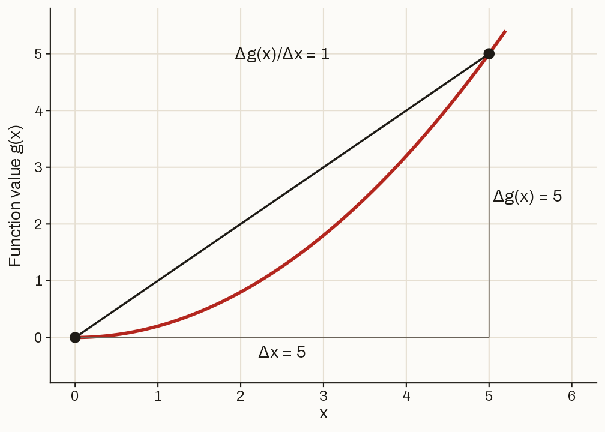

# Derivatives {#sec-derivatives}

```{r setup_derivatives}
#| message: false
source("_common.R")
```

Throughout this chapter, we will work exclusively with continuous functions that map intervals of real numbers into the real numbers.
So unless I specify otherwise, whenever I refer to a function $f$ in this chapter, assume that:

- The domain of $f$ is the real numbers $\mathbb{R}$, or an interval of reals.
- The codomain of $f$ is the real numbers $\mathbb{R}$.
- $f$ is continuous.


## How steep is the function? {#sec-derivatives-steepness}

The derivative of a function, loosely speaking, is a measure of how steeply the function is increasing or decreasing at a particular point along its domain.
This idea of steepness is easiest to see with linear functions.

```{r}
#| label: fig-linear-function-slopes
#| fig-cap: "Two linear functions---one steeper, one flatter."
#| cache: true
tibble(x = seq(0, 5), h = 2 + 0.25 * x, g = x) |>
  pivot_longer(c(h, g), names_to = "fn", values_to = "y") |>
  mutate(fn = fct_inorder(fn)) |> # h first, so it gets teal
  ggplot(aes(x = x, y = y, colour = fn)) +
  geom_line() +
  label_curve(5, 3.25, 'italic(h)*"(x)"', hjust = -0.2) +
  label_curve(5, 5.1, 'italic(g)*"(x)"', colour = mfpa$red, hjust = -0.2) +
  scale_x_continuous(breaks = 0:5, limits = c(0, 5.75)) +
  scale_y_continuous(breaks = 0:5, limits = c(0, 5.25)) +
  labs(x = "x", y = "Function value")
```

Between the two linear functions depicted in @fig-linear-function-slopes, $g(x)$ is steeper and $h(x)$ is flatter.
Specifically, the [slope]{.concept definition="For a linear function, $f(x) = \alpha + \beta x$, the slope is the coefficient $\beta$. It can be calculated using the rise-over-run formula: for any distinct points $x_1$ and $x_2$ in the domain of $f$, $$\beta = \frac{f(x_1) - f(x_2)}{x_1 - x_2}.$$"} of $g(x)$ is greater in magnitude than that of $h(x)$.
You can calculate the slope of a linear function using the "rise over run" formula.
Given any two distinct points along the domain, $x_1$ and $x_2$, we calculate the slope by dividing the difference in function values (the "rise") by the difference in domain values (the "run"): $$\text{slope} = \frac{f(x_1) - f(x_2)}{x_1 - x_2}.$$ {#eq-rise-over-run}

For example, for the functions we've plotted in @fig-linear-function-slopes, let's compare the function values at $x_1 = 4$ to those at $x_2 = 0$.
For the steeper function $g$, we have $g(x_1) = g(4) = 4$ and $g(x_2) = g(0) = 0$.
Therefore, the slope of $g$ is 1: $$\text{slope of $g$} = \frac{g(x_1) - g(x_2)}{x_1 - x_2} = \frac{g(4) - g(0)}{4} = \frac{4 - 0}{4 - 0} = 1.$$
By contrast, the slope of the flatter function $h$ is just 1/4: $$\text{slope of $h$} = \frac{h(x_1) - h(x_2)}{x_1 - x_2} = \frac{h(4) - h(0)}{4 - 0} = \frac{3 - 2}{4} = \frac{1}{4}.$$

::: {#exr-linear-slopes title="Slopes of linear functions"}
Calculate the slope of each function depicted in the figure below.
What are the similarities and differences with the slopes of the functions depicted in @fig-linear-function-slopes?

```{r}
#| cache: true
tibble(x = seq(0, 5), h = 3.25 - 0.25 * x, g = 5 - x) |>
  pivot_longer(c(h, g), names_to = "fn", values_to = "y") |>
  mutate(fn = fct_inorder(fn)) |> # h first, so it gets teal
  ggplot(aes(x = x, y = y, colour = fn)) +
  geom_line() +
  label_curve(5, 2, 'italic(h)*"(x)"', hjust = -0.2) +
  label_curve(5, 0, 'italic(g)*"(x)"', colour = mfpa$red, hjust = -0.2) +
  scale_x_continuous(breaks = 0:5, limits = c(0, 5.75)) +
  scale_y_continuous(breaks = 0:5, limits = c(0, 5.25)) +
  labs(x = "x", y = "Function value")
```

:::: {.answer}
The slope of $g$ is -1:
$$
\begin{aligned}
\frac{g(5) - g(4)}{5 - 4} = \frac{0 - 1}{1} = -1.
\end{aligned}
$$
The slope of $h$ is -1/4:
$$
\begin{aligned}
\frac{h(5) - h(1)}{5 - 1} = \frac{2 - 3}{4} = \frac{-1}{4}.
\end{aligned}
$$
The major contrast with the functions from the earlier figure is that the slopes are now negative, reflecting the fact that these functions are decreasing instead of increasing.
For decreasing functions, the "steeper" decrease is still the function whose slope is greater in [absolute value]{.underline}.
::::
:::

Linear functions are convenient because they are equally "steep" at every point along their domain.
Nonlinear functions, by definition, are not so convenient---their steepness varies across their domain.
As an example, take a look at the nonlinear functions depicted in @fig-nonlinear-function-comparison:
$$
\begin{aligned}
g(x) &= \frac{x^2}{5}; \\
h(x) &= 4 - \frac{(x - 5)^2}{5}.
\end{aligned}
$$

```{r}
#| label: fig-nonlinear-function-comparison
#| fig-cap: "Two increasing nonlinear functions. At lower values of $x,$ $h(x)$ is increasing more steeply than $g(x).$  The opposite is true at greater values of $x.$"
#| cache: true
df_nonlinear_functions <- tibble(
  x = seq(0, 10, by = 0.1),
  g = x^2 / 5,
  h = 4 - (x - 5)^2 / 5
)
df_nonlinear_functions |>
  filter(x <= 5) |>
  pivot_longer(c(h, g), names_to = "fn", values_to = "y") |>
  mutate(fn = fct_inorder(fn)) |> # h first, so it gets teal
  ggplot(aes(x = x, y = y, colour = fn)) +
  geom_line() +
  label_curve(5, 4, 'italic(h)*"(x)"', hjust = -0.2) +
  label_curve(5, 5, 'italic(g)*"(x)"', colour = mfpa$red, hjust = -0.2) +
  scale_x_continuous(breaks = 0:5, limits = c(0, 5.75)) +
  scale_y_continuous(breaks = seq(-1, 5), limits = c(-1, 5.25)) +
  labs(x = "x", y = "Function value")
```

At the leftmost part of the figure, close to $x = 0$, the red function $g(x)$ is nearly flat while the blue function $h(x)$ is clearly increasing.
By contrast, at the rightmost part of the figure, close to $x = 5$, we see that $g(x)$ is clearly increasing while $h(x)$ is nearly flat.
We can glean that much through the eyeball test.
But how can we quantify the "steepness" of each function at each point?
Is there a precise way to say that a function is "nearly flat" at a particular point?
And how can we identify the crossover point, where $g(x)$ starts to increase more steeply than $h(x)$ does?

## Defining the derivative {#sec-derivatives-definition}

One way to calculate the steepness of a nonlinear function at a particular point would be to use the "rise over run" formula (@eq-rise-over-run).
In other words, to gauge the steepness at some point $c$ in the domain of the function, we pick a nearby point $x$ and calculate
$$
\text{steepness at $c$} \approx \frac{f(x) - f(c)}{x - c}.
$$
The closer our chosen point $x$ is to $c$, the better this approximation will be.
For example, let's calculate this approximation at $c = 0$ for the red function $g(x)$ plotted in @fig-nonlinear-function-comparison.
We can tell from the graph that the function is basically flat at $c = 0$, so we should get a "steepness" calculation close to 0.

You can do a few of these calculations yourself to see that the approximation gets closer to 0 as we pick approximation points closer to $c = 0$ along the $x$-axis...
$$
\begin{aligned}
\frac{g(3) - g(0)}{3 - 0} = \frac{(3^2/5) - (0^2/5)}{3 - 0} = \frac{9/5}{3} = \frac{3}{5}; \\
\frac{g(2) - g(0)}{2 - 0} = \frac{(2^2/5) - (0^2/5)}{2 - 0} = \frac{4/5}{2} = \frac{2}{5}; \\
\frac{g(1) - g(0)}{1 - 0} = \frac{(1^2/5) - (0^2/5)}{1 - 0} = \frac{1/5}{1} = \frac{1}{5};
\end{aligned}
$$
...or you can look at @fig-derivative-approximation for an animated illustration of the process.

<!-- Pre-rendered GIF: source in images/anim/derivative_approximation.R (see CLAUDE.md, "Animated figures"). -->
{#fig-derivative-approximation}

No matter how close of an approximation we take, there's always a closer one to take.
You should never be satisfied with the approximation $$\text{steepness at $c$} \approx \frac{f(x) - f(c)}{x - c},$$ because you could have calculated an *even better* approximation at the midpoint between $c$ and your previously chosen approximation point $x$, $$\text{steepness at $c$} \approx \frac{f(\frac{x + c}{2}) - f(c)}{\frac{x + c}{2} - c}.$$

The only way to escape the we-could-have-gotten-even-closer complaint is to *take the limit*.
We will formally define the derivative of a function as the limit of the rise-over-run calculation (@eq-rise-over-run) as we choose approximation points $x$ ever closer and closer to $c$, the point at which we want to calculate the steepness of the function.

::: {#def-derivative name="Derivative of a function"}
Consider the function $f : X \to \mathbb{R}$, where $X \subseteq \mathbb{R}$, and the point $c \in X$.
The [derivative]{.concept definition="The derivative of $f$ at the point $c$, denoted $f'(c)$, is a measure of how steeply the function is increasing or decreasing at that point.  The formal definition of the derivative is that $$f'(c) = \lim_{x \to c} \frac{f(x) - f(c)}{x - c} = \lim_{h \to 0} \frac{f(c + h) - f(c)}{h},$$ provided that this limit exists."} of $f$ at $c$, denoted $f'(c)$, is defined by the limit $$f'(c) = \lim_{x \to c} \frac{f(x) - f(c)}{x - c},$$ provided that this limit exists.
When this limit exists, we say that $f$ is [differentiable at the point]{.concept entry="Differentiability" definition="A function $f : X \to \mathbb{R}$ is differentiable at a point in its domain, $c \in X$, if the derivative $f'(c)$ exists.  We call $f$ a differentiable function if it is differentiable at every point in its domain."} $c$.

If $f$ is differentiable at every point in its domain, we simply say that it is [differentiable]{.concept entry="Differentiability"}.
:::

Let's use the formal definition to calculate the derivative of $g(x)$ at $x = 0$, as we attempted to approximate in @fig-derivative-approximation.
Remember that $g(x) = x^2 / 5$.
Therefore, we have
$$
\begin{aligned}
g'(0)
&= \lim_{x \to 0} \frac{g(x) - g(0)}{x - 0} \\
&= \lim_{x \to 0} \frac{\frac{x^2}{5} - \frac{0^2}{5}}{x} \\
&= \lim_{x \to 0} \frac{x}{5} \\
&= 0.
\end{aligned}
$$
This calculation confirms what we could see from the graph: the function $g(x)$ is essentially flat at $x = 0$.

It would be rather tedious to go through this calculation for any individual point whose derivative we want to calculate.
Luckily, we don't have to do that.
We can plug an arbitrary point $c$ into the formula for a derivative to calculate $g'(c)$:
$$
\begin{aligned}
g'(c)
&= \lim_{x \to c} \frac{g(x) - g(c)}{x - c} \\
&= \lim_{x \to c} \frac{\frac{x^2}{5} - \frac{c^2}{5}}{x - c} \\
&= \lim_{x \to c} \frac{x^2 - c^2}{5 (x - c)} \\
&= \lim_{x \to c} \frac{(x + c) (x - c)}{5 (x - c)} \\
&= \lim_{x \to c} \frac{x + c}{5} \\
&= \frac{2 c}{5}.
\end{aligned}
$$
This formula confirms something we can see in @fig-nonlinear-function-comparison: $g(x)$ gets steeper as we go further to the right along the x-axis.
For example, the effective "slope" of the function at $x = 1$ is $g'(x) = 2 / 5 = 0.4$, whereas the effective slope at $x = 5$ is $g'(x) = 2$.

::: {#exr-deriv-h}
Take the other function plotted in @fig-nonlinear-function-comparison, $$h(x) = 4 - \frac{(x - 5)^2}{5}.$$
Show that $$h'(x) = - \frac{2}{5} (x - 5) = 2 - \frac{2 x}{5}.$$
Confirm that $h'(x)$ decreases as $x$ increases, then find the point in the domain at which $g$ becomes steeper than $h$.

:::: {.answer}
For any real number $c$, we have
$$
\begin{aligned}
h'(c)
&= \lim_{x \to c} \frac{h(x) - h(c)}{x - c} \\
&= \lim_{x \to c} \frac{[4 - \frac{(x - 5)^2}{5}] - [4 - \frac{(c - 5)^2}{5}]}{x - c} \\
&= \lim_{x \to c} \frac{(c - 5)^2 - (x - 5)^2}{5 (x - c)} \\
&= \lim_{x \to c} \frac{(c^2 - 10 c + 25) - (x^2 - 10 x + 25)}{5 (x - c)} \\
&= \lim_{x \to c} \frac{c^2 - 10 c - x^2 + 10 x}{5 (x - c)} \\
&= \lim_{x \to c} \left[\frac{10 (x - c)}{5 (x - c)} - \frac{x^2 - c^2}{5 (x - c)}\right] \\
&= \lim_{x \to c} \left[2 - \frac{(x + c) (x - c)}{5 (x - c)}\right] \\
&= \lim_{x \to c} \left[2 - \frac{x + c}{5}\right] \\
&= 2 - \frac{2 c}{5}.
\end{aligned}
$$

To confirm that $h'(x)$ decreases as $x$ increases, suppose $x < y$.
We have
$$
h'(y) - h'(x) = \left[2 - \frac{2y}{5}\right] - \left[2 - \frac{2x}{5}\right] = \frac{2 (x - y)}{5} < 0
$$
and thus $h'(y) < h'(x)$.

Finally, let's find the crossover point at which $g$ becomes steeper than $h$, i.e., at which $g'(x) > h'(x)$.
We know that $g'(x) = \frac{2x}{5}$ and that $h'(x) = 2 - \frac{2x}{5}$.
The statement $g'(x) > h'(x)$ is therefore equivalent to $$\frac{2x}{5} > 2 - \frac{2x}{5},$$ which in turn is equivalent to $$\frac{4x}{5} > 2.$$
This statement in turn is equivalent to $$x > 2 \cdot \frac{5}{4} = \frac{10}{4} = 2.5,$$ so the crossover point is $x = 2.5$.
::::
:::

::: {#exr-deriv-quadratic}
Let $f : \mathbb{R} \to \mathbb{R}$ be a quadratic function, meaning there exist real numbers $a$, $b$, and $c$ such that $$f(x) = a x^2 + b x + c.$$
Show that $f'(x) = 2 a x + b.$

*Hint:* The calculations will be very similar to the ones from @exr-deriv-h, as the function $h(x)$ there is itself a quadratic function.

:::: {.answer}
For any real number $d$, we have
$$
\begin{aligned}
f'(d)
&= \lim_{x \to d} \frac{f(x) - f(d)}{x - d} \\
&= \lim_{x \to d} \frac{[a x^2 + b x + c] - [a d^2 + b d + c]}{x - d} \\
&= \lim_{x \to d} \frac{a (x^2 - d^2) + b (x - d)}{x - d} \\
&= \lim_{x \to d} \frac{a (x + d) (x - d) + b (x - d)}{x - d} \\
&= \lim_{x \to d} [a (x + d) + b] \\
&= 2 a d + b.
\end{aligned}
$$
::::
:::

::: {.remark title="The many ways to denote derivatives"}
You will sometimes see the derivative written in the fractional form, $$\frac{d f(x)}{d x}.$$
I don't love this notation because it makes it hard to denote "the derivative of $f$ at the specific point $x = c$."
You're stuck with either the ambiguous-seeming $$\frac{d f(c)}{d x}$$ or with the clunky-seeming $$\left. \frac{d f(x)}{d x} \right|_{x = c}.$$

Economists are sometimes fond of using subscripts to denote derivatives, writing $f_x(c)$ to denote the derivative of $f$ at the specific point $x = c$.
They do this more commonly for functions with multiple arguments, as we'll see when we get to multivariable calculus.
In my scholarship I only use this convention in the most dire of notational circumstances, and I will never use it in this course.
:::

### Alternative definition {#sec-derivatives-definition-alt}

There's another way to define the derivative that is sometimes more convenient to work with.
In this alternative definition, we define the "rise" in terms of $f(c + h) - f(c)$ and the "run" in terms of the increment $h$, which may be positive or negative.
We then consider the limit as this increment becomes smaller and smaller in magnitude:
$$f'(c) = \lim_{h \to 0} \frac{f(c + h) - f(c)}{h}.$$
To be clear, both definitions will always lead you to the same answer---which one you use is ultimately a matter of which way you find easiest to solve the problem at hand.

::: {#prp-deriv-alt-def name="Alternative definition of derivative"}
Consider the function $f : X \to \mathbb{R}$, where $X \subseteq \mathbb{R}$, and the point $c \in X$.
The derivative $f'(c)$ exists and is equal to $$\lim_{h \to 0} \frac{f(c + h) - f(c)}{h}$$ if and only if this limit exists.
:::

As an example, we can use the alternative definition to calculate the derivative of the function $g(x)$ plotted in @fig-nonlinear-function-comparison:
$$
\begin{aligned}
g'(c)
&= \lim_{h \to 0} \frac{g(c + h) - g(c)}{h} \\
&= \lim_{h \to 0} \frac{\frac{(c + h)^2}{5} - \frac{c^2}{5}}{h} \\
&= \lim_{h \to 0} \frac{(c + h)^2 - c^2}{5 h} \\
&= \lim_{h \to 0} \frac{(c^2 + 2 c h + h^2) - c^2}{5h} \\
&= \lim_{h \to 0} \frac{2 c h + h^2}{5 h} \\
&= \lim_{h \to 0} \frac{2 c + h}{5} \\
&= \frac{2 c}{5}.
\end{aligned}
$$
I personally find this definition easier for this particular problem.
You might find the other definition easier to work with.
Either way, we end up in the same place, with $g'(c) = 2c / 5.$

::: {#exr-deriv-alt-def}
Redo @exr-deriv-quadratic using the alternative formula for a derivative.

:::: {.answer}
Let $f(x) = a x^2 + b x + c,$ and consider any real number $d.$
We have
$$
\begin{aligned}
f'(d)
&= \lim_{h \to 0} \frac{f(d + h) - f(d)}{h} \\
&= \lim_{h \to 0} \frac{[a (d + h)^2 + b (d + h) + c] - [a d^2 + b d + c]}{h} \\
&= \lim_{h \to 0} \frac{[a d^2 + 2 a d h + a h^2 + b d + b h + c] - [a d^2 + b d + c]}{h} \\
&= \lim_{h \to 0} \frac{2 a d h + a h^2 + b h}{h} \\
&= \lim_{h \to 0} [2 a d + a h + b] \\
&= 2 a d + b.
\end{aligned}
$$
::::
:::

### When the derivative doesn't exist {#sec-derivatives-nonexistence}

The derivative is the limit of the rise-over-run formula.
Because the denominator of that formula approaches zero as we take the limit, its limit is not always guaranteed to exist---and in fact sometimes it does not.

To begin with, you never need to bother trying to calculate the derivative of a function at a point where the function is not continuous---it won't exist.
In logic-speak: if $f$ is not continuous at $c$, then $f'(c)$ does not exist.
Or, equivalently (never forget the contrapositive!), if $f'(c)$ exists, then $f$ is continuous at $c$.

::: {#thm-differentiable-implies-continuous name="Differentiable implies continuous"}
Consider a function $f : X \to \mathbb{R}$, where $X \subseteq \mathbb{R}$, and the point $c \in X$.
If $f$ is differentiable at $c$, then $f$ is continuous at $c$.
:::

::: {.proof}
Suppose $f$ is differentiable at $c$, meaning there is a real number $y$ such that $$\lim_{x \to c} \frac{f(x) - f(c)}{x - c} = y.$$
Using the properties of function limits (@prp-function-limit-properties), we then have
$$
\begin{aligned}
\lim_{x \to c} f(x)
&= \lim_{x \to c} [f(x) - f(c) + f(c)] \\
&= f(c) + \lim_{x \to c} [f(x) - f(c)] \\
&= f(c) + \lim_{x \to c} \left[\frac{f(x) - f(c)}{x - c} \cdot (x - c)\right] \\
&= f(c) + \underbrace{\left(\lim_{x \to c} \frac{f(x) - f(c)}{x - c}\right)}_{ = y} \cdot \underbrace{\left(\lim_{x \to c} [x - c]\right)}_{= 0} \\
&= f(c) + y \cdot 0 \\
&= f(c),
\end{aligned}
$$
so $f$ is continuous at $c.$
:::

@thm-differentiable-implies-continuous tells us that every differentiable function is continuous, but it says nothing about whether every continuous function is differentiable.
(In terms of formal logic, the theorem is an "if" statement rather than an "if and only if.")
In fact, there are continuous functions that are not differentiable.

One example of a function that is continuous but not differentiable is the absolute value function, $f(x) = |x|$ at the point $c = 0$.
The derivative does not exist because the relevant left- and right-hand limits do not agree:
$$
\begin{alignedat}{2}
\lim_{x \to 0^-} \frac{f(x) - f(0)}{x - 0} &= \lim_{x \to 0^-} \frac{-x}{x} &&= -1; \\
\lim_{x \to 0^+} \frac{f(x) - f(0)}{x - 0} &= \lim_{x \to 0^+} \frac{x}{x} &&= 1.
\end{alignedat}
$$

The most common type of non-differentiability in a continuous function that you'll run into is a "kink" in the graph of the function---a point where the direction of the function appears to change sharply instead of smoothly.
The absolute value function illustrates this type of non-differentiability.

```{r}
#| label: fig-abs-value-kink
#| fig-cap: "Non-differentiability due to a kink."
#| cache: true
tibble(x = seq(-1, 1, length.out = 101), y = abs(x)) |>
  ggplot(aes(x = x, y = y)) +
  geom_vline(xintercept = 0) +
  geom_line() +
  mark_value(0, 0) +
  label_curve(0, -0.05, "'kink' at x = 0", parse = FALSE, hjust = -0.1) +
  scale_x_continuous(breaks = seq(-1, 1, by = 0.5)) +
  scale_y_continuous(breaks = seq(0, 1, by = 0.25), limits = c(-0.1, 1)) +
  labs(x = "x", y = "|x|")
```

Another source of non-differentiability is when the function is so steep that its graph approaches a vertical line.
As an example, take the square root function, $f(x) = \sqrt{x},$ evaluated at the point $c = 0.$
The "rise over run" limit here becomes infinitely large as $x \to 0:$
$$
\begin{aligned}
\lim_{x \to 0} \frac{f(x) - f(0)}{x - 0}
&= \lim_{x \to 0} \frac{\sqrt{x}}{x} \\
&= \lim_{x \to 0} \frac{1}{\sqrt{x}} \\
&= \infty.
\end{aligned}
$$

```{r}
#| label: fig-sqrt-asymptote
#| fig-cap: "Non-differentiability due to vertical slope."
#| cache: true
tibble(x = seq(0, 0.5, length.out = 10001), y = sqrt(x)) |>
  ggplot(aes(x = x, y = y)) +
  geom_vline(xintercept = 0) +
  geom_line() +
  label_curve(0, 0.05, "vertical slope at x = 0", parse = FALSE, hjust = -0.05) +
  scale_y_continuous(limits = c(-0.1, 0.8)) +
  labs(
    x = "x",
    y = "Square root of x",
  )
```

## Taking derivatives in practice {#sec-derivatives-in-practice}

I take derivatives all the time in my day job as a formal theorist, yet only rarely do I find myself explicitly taking the limit from @def-derivative.
Instead, I rely on some common derivatives and some useful rules to break down complex-seeming problems.

### Derivatives of common functions {#sec-derivatives-common}

Many of the functions that commonly arise in statistics and game theory have derivatives of known forms.
Here are the most important ones you need to know.

Linear functions
: Any function of the form $f(x) = \alpha + \beta x$, where $\alpha$ and $\beta$ are real numbers, has a derivative of $\beta$ at all points in its domain: $f'(x) = \beta$.

Power functions
: Any function of the form $f(x) = x^a$, where $a$ is a real number, has a derivative of $f'(x) = a x^{a - 1}$.

Natural exponent
: The function $f(x) = e^x$, where $e$ is [Euler's number](https://en.wikipedia.org/wiki/E_(mathematical_constant)) (approximately 2.718), has a derivative of $f'(x) = e^x$.  That's not a typo---the natural exponent is its own derivative.  That is one of the many reasons why Euler's number is special.

Natural logarithm
: The function $f(x) = \log x$ has a derivative of $f'(x) = 1/x$.


::: {#exr-deriv-linear name="Derivative of a linear function"}
Using one of the formal definitions of a derivative, confirm that the derivative of a linear function is $\beta$ at all points in its domain.
Why is this sensible?

:::: {.answer}
To confirm the claim, for any point $c$ in the domain we have
$$
\begin{aligned}
\lim_{x \to c} \frac{f(x) - f(c)}{x - c}
&= \lim_{x \to c} \frac{(\alpha + \beta x) - (\alpha + \beta c)}{x - c} \\
&= \lim_{x \to c} \frac{\beta x - \beta c}{x - c} \\
&= \lim_{x \to c} \frac{\beta (x - c)}{x - c} \\
&= \lim_{x \to c} \beta \\
&= \beta.
\end{aligned}
$$ 
This is sensible because we calculate the derivative by using the rise-over-run formula, and the defining characteristic of a linear function is that the rise-over-run calculation is the same no matter what two points on the domain we're using to calculate it.
::::
:::

::: {#exr-deriv-constant name="Derivative of a constant function"}
A constant function is a function of the form $f(x) = y$, where $y$ is a constant real number.
Without taking an explicit limit, how do you know from the above rules that $f'(x) = 0$ for all $x$?

:::: {.answer}
A constant function is a linear function with slope 0: $f(x) = y = y + 0x.$
Because the derivative of any linear function is its slope, we have $f'(x) = 0.$
::::
:::

### Properties of derivatives {#sec-derivatives-properties}

Using a few rules in combination with the derivatives of common functions from above, we can calculate the derivatives of most functions we run into in practice without explicitly taking limits of the rise-over-run ratio.

If we take a function and multiply it by a constant, the derivative of the resulting function is the same multiple of the original derivative.
This is the [constant multiple rule]{.concept definition="If $g(x) = c f(x)$, where $c$ is a constant real number, then $g'(x) = c f'(x)$."}.

::: {#prp-deriv-constant-multiple name="Constant multiple rule"}
Let $f : X \to \mathbb{R}$ be differentiable, where $X \subseteq \mathbb{R}$.
Define the function $g : X \to \mathbb{R}$ by $g(x) = c f(x)$, where $c$ is a constant real number.
For all $x \in X$, $$g'(x) = c f'(x).$$
:::

::: {.proof}
For any $x \in X$, we have
$$
\begin{aligned}
\lim_{h \to 0} \frac{g(x + h) - g(x)}{h}
&= \lim_{h \to 0} \frac{c f(x + h) - c f(x)}{h} \\
&= \lim_{h \to 0} \left[c \cdot \frac{f(x + h) - f(x)}{h}\right] \\
&= c \lim_{h \to 0} \frac{f (x + h) - f(x)}{h} \\
&= c f'(x),
\end{aligned}
$$
and therefore $g'(x) = c f'(x)$.
:::

For example, we can use the constant multiple rule to find the derivative of [any]{.underline} logarithmic function, not just the natural logarithm.
Let $f(x) = \log_b(x)$, where $b > 0$ and $b \neq 1$.
Using the base change formula from @prp-logarithm-base-change, we know that $$f(x) = \log_b(x) = \frac{\log(x)}{\log(b)} = \frac{1}{\log(b)} \cdot \log(x).$$
In other words, the logarithm with base $b$ is just a constant multiple of the natural logarithm.
Using this fact, we can find the derivative: $$f'(x) = \frac{1}{\log(b)} \cdot \frac{d \log(x)}{d x} = \frac{1}{\log(b)} \cdot \frac{1}{x} = \frac{1}{x \log(b)}.$$

Another convenient property is that the derivative of the sum is equal to the sum of the derivatives.
You'll end up using the [sum rule]{.concept definition="If $h(x) = f(x) + g(x)$, then $h'(x) = f'(x) + g'(x)$."} so often that you stop thinking about it.

::: {#prp-deriv-sum name="Sum rule"}
Let $f : X \to \mathbb{R}$ and $g : X \to \mathbb{R}$ be differentiable, where $X \subseteq \mathbb{R}$.
Define the function $h : X \to \mathbb{R}$ by $h(x) = f(x) + g(x)$.
For all $x \in X$, $$h'(x) = f'(x) + g'(x).$$
:::

::: {.proof}
For any $x \in X$, we have
$$
\begin{aligned}
\lim_{t \to 0} \frac{h(x + t) - h(x)}{t}
&= \lim_{t \to 0} \frac{[f(x + t) + g(x + t)] - [f(x) + g(x)]}{t} \\
&= \lim_{t \to 0} \left[\frac{f(x + t) - f(x)}{t} + \frac{g(x + t) - g(x)}{t}\right] \\
&= \lim_{t \to 0} \frac{f(x + t) - f(x)}{t} + \lim_{t \to 0} \frac{g(x + t) - g(x)}{t} \\
&= f'(x) + g'(x),
\end{aligned}
$$
and therefore $h'(x) = f'(x) + g'(x)$.
:::

I've stated the sum rule just for a sum of two functions.
In fact, it applies with equal force to any sum of a finite number of functions.
For any collection of differentiable functions $f_1, f_2, \ldots, f_n$, their sum $$h(x) = \sum_{i=1}^n f_i(x)$$ has the derivative $$h'(x) = \sum_{i=1}^n f_i'(x).$$ {#eq-deriv-finite-sum}

::: {#exr-deriv-linear-combination name="Derivative of a linear combination of functions"}
Let $f : X \to \mathbb{R}$ and $g : X \to \mathbb{R}$ be differentiable, where $X \subseteq \mathbb{R}$.
Let $a \in \mathbb{R}$ and $b \in \mathbb{R}$ be constants.
Define the function $h : X \to \mathbb{R}$ by $h(x) = a f(x) + b g(x)$.
Use the constant rule and the sum rule to show that $$h'(x) = a f'(x) + b g'(x).$$

:::: {.answer}
This is one of those cases where it's convenient to use the fractional notation for a derivative.
We have
$$
\begin{aligned}
\frac{d h(x)}{d x}
&= \frac{d}{dx} \left[a f(x) + b g(x)\right] \\
&= \frac{d}{dx} \left[a f(x)\right] + \frac{d}{dx} \left[b g(x)\right] \\
&= a \frac{d f(x)}{d x} + b \frac{d g(x)}{d x},
\end{aligned}
$$
where the first equality uses our definition of $h(x),$ the second uses the sum rule, and the third uses the constant multiple rule twice.
::::
:::

::: {#exr-deriv-polynomial name="Derivative of a polynomial"}
Let $f : X \to \mathbb{R}$ be a polynomial, so that
$$
\begin{aligned}
f(x) = c_n x^n + c_{n-1} x^{n-1} + \cdots + c_1 x + c_0 = \sum_{k=0}^n c_k x^k
\end{aligned}
$$
for some natural number $n$ and real-valued coefficients $c_0, \ldots, c_n.$
Use the constant multiple rule, the derivative of a power function, and @eq-deriv-finite-sum to prove that
$$
\begin{aligned}
f'(x) = n c_n x^{n - 1} + (n - 1) c_{n-1} x^{n-2} + \cdots + c_1 = \sum_{k=1}^n k c_k x^{k-1}.
\end{aligned}
$$

:::: {.answer}
Using @eq-deriv-finite-sum, we have
$$
\begin{aligned}
f'(x) = \sum_{k=0}^n \frac{d}{dx} \left[c_k x^{k}\right].
\end{aligned}
$$
Using the constant multiple rule, we then have
$$
\begin{aligned}
f'(x) = \sum_{k=0}^n c_k \frac{d}{dx} \left[x^{k}\right].
\end{aligned}
$$
Finally, using the derivative of a power function, we have
$$
\begin{aligned}
f'(x) = \sum_{k=0}^n c_k \left[k x^{k-1}\right].
\end{aligned}
$$
We can take the $k = 0$ term out of the sum,
$$
\begin{aligned}
f'(x)
&= \sum_{k=0}^n c_k \left[k x^{k-1}\right] \\
&= \underbrace{0 \cdot c_0 \cdot x^{-1}}_{= 0} + \sum_{k=1}^n k c_k x^{k-1} \\
&= \sum_{k=1}^n k c_k x^{k-1},
\end{aligned}
$$
proving the claim.
::::
:::

Unfortunately for us, derivatives of products don't work quite as intuitively as derivatives of sums.
In general, it is [not true]{.underline} that the derivative of $f(x) g(x)$ equals $f'(x) g'(x)$.

As an illustration, think about the quadratic function $h(x) = x^2 = x \cdot x$.
If it were true that the derivative of the product equals the product of the derivatives, then we would have $h(x) = 1 \cdot 1 = 1$, falsely implying that the quadratic function is actually linear.

All that said, we still have a convenient formula to calculate the derivative of a product---it's just not as convenient as the derivative of a sum.
The [product rule]{.concept definition="If $h(x) = f(x) g(x)$, then $h'(x) = f(x) g'(x) + f'(x) g(x)$."} to take the derivative of $f(x) g(x)$ essentially breaks the problem into two parts.
First we treat $f(x)$ as if it were a constant and take the derivative of $g(x)$, then we do the reverse, and finally we add the two results together.

::: {#prp-product-rule name="Product rule"}
Let $f : X \to \mathbb{R}$ and $g : X \to \mathbb{R}$ be differentiable, where $X \subseteq \mathbb{R}$.
Define the function $h : X \to \mathbb{R}$ by $h(x) = f(x) \cdot g(x)$.
For all $x \in X$,
$$
\begin{aligned}
h'(x) = f(x) g'(x) + f'(x) g(x).
\end{aligned}
$$
:::

::: {.proof}
Take any $x \in X$.
Differentiability of $f$ implies continuity of $f$ (per @thm-differentiable-implies-continuous) and thus $\lim_{t \to 0} f(x + t) = f(x).$
Consequently,
$$
\begin{aligned}
& \lim_{t \to 0} \frac{h(x + t) - h(x)}{t} \\
&= \lim_{t \to 0} \frac{f(x + t) g(x + t) - f(x) g(x)}{t} \\
&= \lim_{t \to 0} \frac{f(x + t) g(x + t) - f(x + t) g(x) + f(x + t) g(x) - f(x) g(x)}{t} \\
&= \lim_{t \to 0} \frac{f(x + t) [g(x + t) - g(x)]}{t} + \lim_{t \to 0} \frac{[f(x + t) - f(x)] g(x)}{t} \\
&= \left[\lim_{t \to 0} f(x + t)\right] \cdot \left[\lim_{t \to 0} \frac{g(x + t) - g(x)}{t}\right] + \left[\lim_{t \to 0} \frac{f(x + t) - f(x)}{t}\right] \cdot g(x) \\
&= f(x) g'(x) + f'(x) g(x),
\end{aligned}
$$
and therefore $h'(x) = f(x) g'(x) + f'(x) g(x)$.
:::

Going back to our example of the quadratic function $h(x) = x^2$, proper use of the product rule confirms that $h'(x) = 2x$.
Let $f(x) = g(x) = x$, so that $f'(x) = g'(x) = 1$ and $h(x) = f(x) \cdot g(x)$.
The product rule then gives us
$$
\begin{aligned}
h'(x) &= f(x) g'(x) + f'(x) g(x) \\
&= x \cdot 1 + 1 \cdot x \\
&= 2x.
\end{aligned}
$$

Now let's get some more practice with the product rule through some exercises.

::: {#exr-product-rule-applications name="Product rule applications"}
Find the derivatives of the following functions.

1. $f(x) = (2x + 1) (x - 3)$.

2. $f(x) = x e^x$.

3. $f(x) = e^{2x}$.

4. $f(x) = e^x \cdot \log(x) \cdot x^3$.

:::: {.answer title="Answers"}
1. You could solve this one by observing that $f(x) = 2x^2 - 5x - 3$, then applying the formula for the derivative of a polynomial (see @exr-deriv-polynomial) to yield $f'(x) = 4 x - 5$.
   We get to the same place if we instead use the product rule:
   $$
   \begin{aligned}
   f'(x) &= (2x + 1) \cdot 1 + 2 \cdot (x - 3) \\
   &= 2x + 1 + 2x - 6 \\
   &= 4x - 5.
   \end{aligned}
   $$

2. Let $g(x) = x$ so that $g'(x) = 1$, and let $h(x) = e^x$ so that $h'(x) = e^x$.
   We have
   $$
   \begin{aligned}
   f'(x) &= g(x) h'(x) + g'(x) h(x) \\
   &= x \cdot e^x + 1 \cdot e^x \\
   &= (x + 1) e^x.
   \end{aligned}
   $$

3. Let $g(x) = h(x) = e^x$ so that $g'(x) = h'(x) = e^x$.
   We have
   $$
   \begin{aligned}
   f'(x) &= g(x) h'(x) + g'(x) h(x) \\
   &= e^x \cdot e^x + e^x \cdot e^x \\
   &= e^{2x} + e^{2x} \\
   &= 2 e^{2x}.
   \end{aligned}
   $$

4. This one makes us use the product rule twice.
   We have
   $$
   \begin{aligned}
   f'(x)
   &= \frac{d}{dx} \left[e^x \cdot \log(x) \cdot x^3\right] \\
   &= e^x \cdot \left[\frac{d}{dx} \left(\log(x) \cdot x^3\right)\right] + \left[\frac{d}{dx} e^x\right] \cdot \left[\log(x) \cdot x^3\right] \\
   &= e^x \cdot \left[\log(x) \cdot \left(\frac{d}{dx} x^3\right) + \left(\frac{d}{dx} \log(x)\right) \cdot x^3\right] \\ &\quad + \left[\frac{d}{dx} e^x\right] \cdot \left[\log(x) \cdot x^3\right] \\
   &= e^x \cdot \left[\log(x) \cdot (3 x^2) + \left(\frac{1}{x}\right) \cdot x^3\right] + \left[e^x \cdot \log(x) \cdot x^3\right] \\
   &= 3 e^x \cdot \log(x) \cdot x^2 + e^x \cdot x^2 + e^x \cdot \log(x) \cdot x^3.
   \end{aligned}
   $$
   This example is an illustration of a generalization of the product rule:
   $$
   \begin{aligned}
   &\frac{d}{dx} [f(x) \cdot g(x) \cdot h(x)] \\&\qquad = f(x) g(x) h'(x) + f(x) g'(x) h(x) + f'(x) g(x) h(x).
   \end{aligned}
   $$
   I'll leave it to you to prove that general claim.
::::
:::

::: {#exr-deriv-of-square name="Derivative of the square of a function"}
Let $f : X \to \mathbb{R}$ be differentiable, where $X \subseteq \mathbb{R}$.
Define the function $g : X \to \mathbb{R}$ by $g(x) = f(x)^2$.
Using the product rule, prove that $$g'(x) = 2 f'(x) f(x).$$

:::: {.answer}
We have $g(x) = f(x) \cdot f(x)$, so the product rule implies $$g'(x) = f(x) f'(x) + f'(x) f(x) = 2 f'(x) f(x).$$
::::
:::

The [quotient rule]{.concept definition="If $h(x) = f(x) / g(x),$ then $$h'(x) = \frac{f'(x) g(x) - f(x) g'(x)}{g(x)^2}.$$"} for functions in the form $\frac{f(x)}{g(x)}$ is unfortunately a bit trickier to remember.
If you have to Google this one every time you use it, don't worry --- you're not alone.

::: {#prp-quotient-rule name="Quotient rule"}
Let $f : X \to \mathbb{R}$ and $g : X \to \mathbb{R} \setminus \{0\}$ be differentiable, where $X \subseteq \mathbb{R}$.
Define the function $h : X \to \mathbb{R}$ by $h(x) = \frac{f(x)}{g(x)}$.
For all $x \in X$, $$h'(x) = \frac{f'(x) g(x) - f(x) g'(x)}{g(x)^2}.$$
:::

I'm not going to prove the quotient rule here---you'll do that yourself once you've got the chain rule in hand.
Before then, let's work through some practice with the quotient rule.
If you use it enough, maybe you'll actually start to remember it?

::: {#exr-csf-derivative name="Contest success function"}
A helpful tool in formal models of conflict is the contest success function, whose most common form is $$f(x) = \frac{\alpha x}{\alpha x + y}.$$
You can think of $x$ here as the amount of resources that I'm devoting toward the conflict, $y > 0$ as the amount of resources that my enemy has devoted, and $\alpha > 0$ as the "force multiplier" on my effort (how much bang for the buck I'm getting).
The output of the function represents my probability of winning the conflict, as a function of the amount of resources I devote.

1. Use the quotient rule to derive $f'(x)$.

2. The derivative $f'(x)$ represents approximately how much my chance of victory increases with each unit of resources I expend.
   Imagine that I don't want to put in a unit of resources that gets me less than a 1% increase in the chance of victory.
   Then what's the largest value of $x$ that I'd be willing to choose?
   (The answer will depend on the values of $\alpha$ and $y$.)

:::: {.answer}
Think of $f(x) = g(x) / h(x)$ where $g(x) = \alpha x$ and $h(x) = \alpha x + y$.
Then, using the quotient rule, we have
$$
\begin{aligned}
f'(x)
&= \frac{g'(x) h(x) - g(x) h'(x)}{h(x)^2} \\
&= \frac{\alpha (\alpha x + y) - (\alpha x) \alpha}{(\alpha x + y)^2} \\
&= \frac{\alpha y}{(\alpha x + y)^2}.
\end{aligned}
$$

The second question essentially asks us to find the value of $x$ that solves $f'(x) = 0.01$:
$$
\begin{aligned}
f'(x) = 0.01
&\quad\Leftrightarrow\quad \frac{\alpha y}{(\alpha x + y)^2} = 0.01 \\
&\quad\Leftrightarrow\quad (\alpha x + y)^2 = 100 \alpha y \\
&\quad\Leftrightarrow\quad \alpha x + y = 10 \sqrt{\alpha y} \\
&\quad\Leftrightarrow\quad x = \frac{10 \sqrt{\alpha y} - y}{\alpha}.
\end{aligned}
$$
::::
:::

::: {#exr-conditional-prob-deriv name="Derivative of a conditional probability"}
Let $X$ be a random variable that has a binomial distribution with $n = 2$ and probability parameter $p$, so that we have
$$
\begin{aligned}
\Pr(X = 0) &= (1 - p)^2, \\
\Pr(X = 1) &= 2 p (1 - p), \\
\Pr(X = 2) &= p^2.
\end{aligned}
$$
The conditional probability $\Pr(X = 2 \mid X \geq 1)$ is equal to
$$
\begin{aligned}
\Pr(X = 2 \mid X \geq 1)
= \frac{\Pr(X = 2)}{\Pr(X = 1) + \Pr(X = 2)}
= \frac{p^2}{2 p (1 - p) + p^2}.
\end{aligned}
$$
Taking this conditional probability to be a function of the parameter $p$, find its derivative and show that the derivative is positive for all $p \in (0, 1]$.

:::: {.answer}
Defining the function $$f(p) = \frac{p^2}{2p (1 - p) + p^2} = \frac{p^2}{2p - p^2},$$ we have
$$
\begin{aligned}
f'(p)
&= \frac{2p (2p - p^2) - p^2 (2 - 2p)}{(2p - p^2)^2} \\
&= \frac{4 p^2 - 2 p^3 - 2 p^2 + 2 p^3}{(2p - p^2)^2} \\
&= \frac{p^2}{(2p - p^2)^2}.
\end{aligned}
$$
We have $p^2 > 0$ and $(2p - p^2)^2 > 0$ for all $p \neq 0$, and therefore $f'(p) > 0$ for all $p \in (0, 1]$.
::::
:::

## The chain rule {#sec-chain-rule}

What do we do when we run into a function that isn't obviously a sum or product or quotient of some other function whose derivative we know how to take?
For example, think about the function $$h(x) = e^{-(x - \mu)^2},$$ a close cousin of the probability density function of the normal distribution with mean $\mu$ and variance 1.
We know that the derivative of $e^x$ is $e^x$.
And by observing that $$-(x - \mu)^2 = -[x^2 - 2 x \mu + \mu^2] = 2 x \mu - x^2 - \mu^2,$$ we know that its derivative is $2 (\mu - x)$.
Is there a way we can put these together to figure out the derivative of $h(x)$?

The [chain rule]{.concept definition="If $h(x) = f(g(x))$, then $h'(x) = f'(g(x)) \cdot g'(x)$."} helps us deal with situations like this one.
Specifically, suppose we have a function of the form $$h(x) = f(g(x)),$$ aka the composition (@def-composition) of $f$ and $g$, where $f$ and $g$ are both differentiable.
In our example, we can decompose $h$ into functions $f$ and $g$ whose derivatives we know.
We'll decompose it using
$$
\begin{aligned}
f(x) &= e^x; \\
g(x) &= -(x - \mu)^2,
\end{aligned}
$$
which we can confirm is a valid decomposition via
$$
f(g(x)) = e^{g(x)} = e^{-(x - \mu)^2} = h(x).
$$

::: {#prp-chain-rule name="Chain rule"}
Let $f : Y \to \mathbb{R}$ and $g : X \to Y$ be differentiable, where $X \subseteq \mathbb{R}$ and $Y \subseteq \mathbb{R}$.
Define the composition $h$ by $h(x) = f(g(x))$.
For all $x \in X$, $$h'(x) = f'(g(x)) \cdot g'(x).$$
:::

Using the chain rule with our example of $h(x) = e^{-(x - \mu)^2}$, we can calculate the derivative:
$$
\begin{aligned}
h'(x)
&= f'(g(x)) \cdot g'(x) \\
&= f'(-(x - \mu)^2) \cdot g'(x) \\
&= e^{-(x - \mu)^2} \cdot 2 (\mu - x) \\
&= 2 (\mu - x) e^{-(x - \mu)^2}.
\end{aligned}
$$
If we look at the graph of this function, we see that it increases on $(-\infty, \mu)$ and decreases on $(\mu, \infty)$.

```{r}
#| label: fig-bell-curve
#| fig-cap: "A function shaped like a bell curve"
#| cache: true
mu <- 2
tibble(
  x = seq(mu - 3, mu + 3, length.out = 501),
  y = exp(-1 * (x - mu)^2)
) |>
  ggplot(aes(x = x, y = y)) +
  geom_line() +
  scale_x_continuous(
    breaks = seq(mu - 3, mu + 3),
    labels = c("µ − 3", "µ − 2", "µ − 1", "µ", "µ + 1", "µ + 2", "µ + 3")
  ) +
  labs(x = "", y = "")
```

Our expression for the derivative provides further confirmation that the function increases up to $x = \mu$ and decreases thereafter.
The key thing to observe is that $e^z > 0$ for all real numbers $z$.
Therefore, if $x < \mu$, then we have $$h'(x) = 2 \underbrace{(\mu - x)}_{> 0} \underbrace{e^{-(x - \mu)^2}}_{> 0} > 0.$$
If instead $x > \mu$, then we have $$h'(x) = 2 \underbrace{(\mu - x)}_{< 0} \underbrace{e^{-(x - \mu)^2}}_{> 0} < 0.$$

::: {#exr-deriv-exponent name="Derivative of an exponential function"}
Let $b$ be a positive constant, and define the function $f(x) = b^x$.
Using the chain rule, show that $f'(x) = b^x \cdot \log(b)$.

*Hint:* Start out by using the fact that $b = e^{\log(b)}$.

:::: {.answer}
We have $$f(x) = b^x = (e^{\log(b)})^x = e^{\log(b) \cdot x}.$$
Define the "inner" function $h(x) = \log(b) \cdot x$ (with derivative $h'(x) = \log(b)$) and the "outer" function $g(x) = e^x$ (with derivative $g'(x) = e^x$), so that we have $$f(x) = e^{\log(b) \cdot x} = e^{h(x)} = g(h(x)).$$
Then, using the chain rule, we have
$$
\begin{aligned}
f'(x)
&= g'(h(x)) \cdot h'(x) \\
&= g'(\log(b) \cdot x) \cdot h'(x) \\
&= e^{\log(b) \cdot x} \cdot \log(b) \\
&= b^x \cdot \log(b).
\end{aligned}
$$
::::
:::

::: {#exr-deriv-exponential-cdf name="Derivative of the exponential CDF"}
For all $x \geq 0$, the cumulative distribution function of the [exponential distribution](https://en.wikipedia.org/wiki/Exponential_distribution) with rate parameter $\lambda > 0$ is $$F(x) = 1 - e^{-\lambda x}.$$
Characterize the probability density function of this distribution by finding the derivative of the cumulative distribution function.

:::: {.answer}
Let's first just look at $e^{-\lambda x}$.
We can think of this as a composition of the "outer" function $g(x) = e^x$ (with derivative $g'(x) = e^x$) and the "inner" function $h(x) = -\lambda x$ (with derivative $h'(x) = -\lambda$).
Therefore, its derivative is $$g'(h(x)) \cdot h'(x) = g'(-\lambda x) \cdot h'(x) = e^{-\lambda x} \cdot -\lambda.$$

Returning to the full expression for the CDF and applying the sum rule, we have
$$
\begin{aligned}
F'(x)
&= \frac{d}{dx} \left[1 - e^{-\lambda x}\right] \\
&= \left[\frac{d}{dx} (1) - \frac{d}{dx} \left(e^{-\lambda x}\right) \right] \\
&= \left[0 - e^{-\lambda x} \cdot -\lambda\right] \\
&= \lambda e^{-\lambda x}.
\end{aligned}
$$
::::
:::

::: {#exr-deriv-logistic-cdf name="Derivative of the logistic CDF"}
For all $x \in \mathbb{R}$, the cumulative distribution function of the [logistic distribution](https://en.wikipedia.org/wiki/Logistic_distribution) is $$F(x) = \frac{1}{1 + e^{-x}}.$$
Characterize the probability density function of this distribution by finding the derivative of the cumulative distribution function.

:::: {.answer}
We have $F(x) = (1 + e^{-x})^{-1}$.
By repeatedly applying the chain rule, we have
$$
\begin{aligned}
F'(x)
&= (-1) (1 + e^{-x})^{-2} \cdot \frac{d}{dx} [1 + e^{-x}] \\
&= -(1 + e^{-x})^{-2} \cdot \frac{d}{dx} e^{-x} \\
&= -(1 + e^{-x})^{-2} \cdot e^{-x} \cdot \frac{d}{dx} [-x] \\
&= -(1 + e^{-x})^{-2} \cdot e^{-x} \cdot -1 \\
&= \frac{e^{-x}}{(1 + e^{-x})^2}.
\end{aligned}
$$
::::
:::

::: {#exr-deriv-log-f name="Derivative of the logarithm of a function"}
Let $f$ be a differentiable function that maps from $X \subseteq \mathbb{R}$ into the strictly positive reals, $(0, \infty)$.
Define the function $g(x) = \log [f(x)]$.
Prove that $$g'(x) = \frac{f'(x)}{f(x)}.$$

:::: {.answer}
$g$ is the composition of the natural logarithm and $f$.
Therefore, by the chain rule,
$$
\begin{aligned}
g'(x)
&= \log' [f(x)] \cdot f'(x) \\
&= \frac{1}{f(x)} \cdot f'(x) \\
&= \frac{f'(x)}{f(x)}.
\end{aligned}
$$
::::
:::

::: {#exr-quotient-rule name="Proving the quotient rule"}
Use the product rule and the chain rule to prove the quotient rule.

*Hint:* Start with the fact that $\frac{f(x)}{g(x)} = f(x) \cdot g(x)^{-1}$.

:::: {.answer}
Define $h(x) = \frac{f(x)}{g(x)} = f(x) \cdot g(x)^{-1}$.
By the product rule,
$$
\begin{aligned}
h'(x)
&= f(x) \cdot \frac{d}{dx} \left[g(x)^{-1}\right] + f'(x) \cdot g(x)^{-1}.
\end{aligned}
$$
Using the chain rule, we have
$$
\begin{aligned}
\frac{d}{dx} \left[g(x)^{-1}\right]
&= (-1) g(x)^{-2} \cdot g'(x) \\
&= \frac{-g'(x)}{g(x)^2}.
\end{aligned}
$$
Substituting this into the product rule calculation from before, we have
$$
\begin{aligned}
h'(x)
&= f(x) \cdot \frac{d}{dx} \left[g(x)^{-1}\right] + f'(x) \cdot g(x)^{-1} \\
&= f(x) \cdot \frac{-g'(x)}{g(x)^2} + f'(x) \cdot \frac{1}{g(x)} \\
&= \frac{- f(x) g'(x)}{g(x)^2} + \frac{f'(x)}{g(x)} \\
&= \frac{- f(x) g'(x)}{g(x)^2} + \frac{f'(x) g(x)}{g(x)^2} \\
&= \frac{f'(x) g(x) - f(x) g'(x)}{g(x)^2}.
\end{aligned}
$$
::::
:::

So why does the chain rule work?
Here's one oversimplified way to think about it.
Consider a function $h$ that's a composition of differentiable functions $f$ and $g$, so that $h(x) = f(g(x))$.
Imagine starting at some value $c$ in the domain, then moving some small amount $\Delta$ to the right along the x-axis.
What happens to the value of $h(x)$ as we move from $x = c$ to $x = c + \Delta$?

First let's trace what happens to the value of the "inner" function, $g(x)$.
If $g'(c) > 0$, so $g$ is increasing near $x = c$, then we'd expect $g(c + \Delta) > g(c)$; we'd expect the opposite if $g'(c) < 0$.
More to the point, since we're taking $\Delta$ to be small---close to 0---we can use the derivative at $x = c$ to approximate $g(c + \Delta)$:
$$
\begin{aligned}
g(c + \Delta)
&= g(c) + g(c + \Delta) - g(c) \\
&= g(c) + \Delta \cdot \frac{g(c + \Delta) - g(c)}{\Delta} \\
&\approx g(c) + \Delta \cdot \lim_{d \to 0} \frac{g(c + d) - g(c)}{d} \\
&= g(c) + \Delta g'(c).
\end{aligned}
$$

Now let's move to the "outer" function, $f(y)$.
In general, for a shift of size $\epsilon$ for the input to $f$, we have
$$
f(y + \epsilon) \approx f(y) + \epsilon f'(y),
$$
following the same approximation logic we just went through.
In this case, the original input is $y = g(c)$, which is shifting by approximately $\epsilon = \Delta g'(c)$.
Putting everything together, the value of the composition at $x = c + \Delta$ is approximately
$$
\begin{aligned}
h(c + \Delta)
&= f(g(c + \Delta)) \\
&\approx f(g(c) + \Delta g'(c)) \\
&\approx f(g(c)) + (\Delta g'(c)) \cdot f'(g(c)) \\
&= h(c) + \Delta \cdot \underbrace{f'(g(c)) \cdot g'(c)}_{\text{look familiar?!}}.
\end{aligned}
$$
If we plug this approximation into the definition of the derivative of the composition $h$ at $c$, we just end up with the chain rule:
$$
\begin{aligned}
h'(c)
&= \lim_{\Delta \to 0} \frac{h(c + \Delta) - h(c)}{\Delta} \\
&\approx \lim_{\Delta \to 0} \frac{[h(c) + \Delta \cdot f'(g(c)) \cdot g'(c)] - h(c)}{\Delta} \\
&= \lim_{\Delta \to 0} \frac{\Delta \cdot f'(g(c)) \cdot g'(c)}{\Delta} \\
&= f'(g(c)) \cdot g'(c).
\end{aligned}
$$

::: {#exr-chain-rule-double-decreasing name="Composition of two decreasing functions"}
Let $f : \mathbb{R} \to \mathbb{R}$ and $g : \mathbb{R} \to \mathbb{R}$ both be differentiable functions that are strictly decreasing.
By strictly decreasing, I mean that if $x < x'$, then $g(x) > g(x')$; and if $y < y'$, then $f(y) > f(y')$.

Consider the composition $h(x) = (f \circ g)(x) = f(g(x))$.
First, without taking any derivatives, explain why $h$ is a strictly *increasing* function of $x$.
Then use the chain rule to confirm this.

:::: {.answer}
Consider any real numbers $a$ and $b$ where $a < b$.
Because $g$ is strictly decreasing, we have $g(a) > g(b)$.
Then, because $f$ is strictly decreasing, we have $f(g(a)) < f(g(b))$.
This in turn means that $h(a) < h(b)$.
We've shown that $a < b$ implies $h(a) < h(b)$, which means $h$ is strictly increasing.

To confirm this with the chain rule, notice that $f$ strictly decreasing means $f'(y) < 0$ for all $y$, and similarly $g'(x) < 0$ for all $x$.
Therefore, for all $x$, we have
$$
h'(x)
= \underbrace{f'(g(x))}_{< 0} \cdot \underbrace{g'(x)}_{< 0}
> 0,
$$
so $h$ is strictly increasing.
::::
:::


::: {#concept-review}
:::
