# Set Theory {#sec-set-theory}

## Introduction {#sec-set-theory-intro}

### Why start here? {#sec-why-sets}

We begin with [set theory]{.concept definition="The study of sets and their properties. A key logical foundation for all of mathematics."}, the branch of mathematics concerned with abstract collections of objects and the operations we may perform on them.
While "abstract collections of objects" might not sound very exciting, even compared to the typical mathematical subject, there are important reasons for us to begin here.
These reasons can get rather philosophical:

> Among all mathematical disciplines, set theory occupies a special place because it plays two very different roles at the same time: on the one hand, it is an area of mathematics devoted to the study of abstract sets and their properties; on the other, *it provides mathematics with its foundation*.
> (*The Princeton Companion to Mathematics*, pp. 615--616, emphasis added.)

But you're studying to be a political scientist, not a mathematician, so why do *you* need to begin with set theory?
First, a surprising amount of mathematical language boils down to statements about sets.
"A probability is a number between 0 and 1, inclusive" is a statement about sets, as is "The function $f(x) = x^2$ is continuous."
<!-- You can even think of "$1 + 1 = 2$" as a set-theoretic statement, as the 20th century philosophical monograph *Principia Mathematica* famously spends more than a hundred pages establishing, though we won't be going nearly that deep here. -->
If you want to properly read papers that present new statistical techniques or that develop theories using formal models --- and you certainly will want to read these papers, not just to succeed in our program but also to have a long career in the discipline --- you'll need to get comfortable with the basics of set-theoretic grammar.

Second, as you'll soon see in the stats sequence, you'll be working with sets a lot in probability theory.
"Events" in probability are defined as sets; joint and conditional probabilities involve operations on these sets.
To understand foundational concepts of inference like [Bayes' rule](https://en.wikipedia.org/wiki/Bayes%27_theorem), you need some set-theoretic background.

Finally, I want you to think about "doing math" as more than just performing computations.
Math, at its core, is the science of *making arguments* that are backed by *logical proofs*.
For most of the course, while we work through the essential computational techniques you'll need for the stats sequence, we will only make occasional glances at mathematical proofs.
But we'll study logic and proof writing more in depth at the end of the course, in @sec-logic, where you'll see that set-theoretic statements are a great place to start building your argument-stating and proof-writing skills.

### Basics of sets {#sec-set-basics}

All right, so what is a set?
For our purposes,^[If you go deep into set theory, you end up arriving at questions like whether we can coherently discuss objects like [the set of all sets that don't contain themselves](https://en.wikipedia.org/wiki/Russell%27s_paradox). We will not be going that deep.]
a set is just an unordered collection of distinct objects.

::: {#def-set name="Sets and elements"}
A [set]{.concept definition="Informally, a collection of objects (not necessarily numbers).  A set $S$ with elements $a,$ $b,$ and $c$ is written $S = \\{a, b, c\\}$."} is a collection of objects, each of which is an [element]{.concept definition='A member of a set.  We write $a \in A$ to mean "$a$ is an element of the set $A$."'} of the set.
For example, the notation $$A = \{1, 2, 4, 8\}$$ is equivalent to saying "$A$ is the set whose elements are 1, 2, 4, and 8."
To denote that the object $a$ is an element of the set $A,$ we write $a \in A.$
:::

It is conventional --- not just in my notes, but in mathematical writing generally --- to use capital letters to denote sets and lowercase letters to denote their elements.
But be aware, sometimes it is convenient or necessary to break this convention.

Math is not just about numbers, and that starts with the fact that sets may contain objects that aren't numbers.
For example, we might define $P$ as the set of people who have been US presidents, so that $\text{John Adams} \in P$ and $\text{LeBron James} \notin P$.

Although sets aren't just for numbers, there are a few sets of numbers that come up so often that we have special names for them.
These are listed in @tbl-number-sets.

| Name             | Notation     | Definition                                                                                                                                                            |
|:-----------------|:------------:|:----------------------------------------------------------------------------------------------------------------------------------------------------------------------|
| Natural numbers  | $\mathbb{N}$ | The counting numbers: 1, 2, 3, ... and so on indefinitely.  (Some textbooks treat 0 as a natural number, but usually not.)                                            |
| Integers         | $\mathbb{Z}$ | The whole numbers: ..., -2, -1, 0, 1, 2, ...                                                                                                                          |
| Rational numbers | $\mathbb{Q}$ | Numbers that can be expressed as a quotient (hence the symbol $\mathbb{Q}$) of integers, $\frac{a}{b}$, where $a \in \mathbb{Z}$, $b \in \mathbb{Z}$, and $b \neq 0$. |
| Real numbers     | $\mathbb{R}$ | Every number on the number line, including irrational numbers like $\sqrt{2}$ and $\pi$.                                                                              |
| Closed interval  | $[a, b]$     | Every real number between $a$ and $b$, including $a$ and $b$ themselves.                                                                                              |
| Open interval    | $(a, b)$     | Every real number between $a$ and $b$, [not]{.underline} including $a$ and $b$ themselves.                                                                                                                                                                      |

: Notable sets of numbers {#tbl-number-sets tbl-colwidths="[30, 10, 60]"}

What if you wanted to define $A$ as the set of natural numbers that are greater than 1000?
Well, you could --- and often should --- simply write, "Let $A$ be the set of natural numbers that are greater than 1000."
Don't fall into the trap of equating rigor with fancy notation.
If ordinary language can clearly communicate what you mean, use it.

That said, there are times when ordinary language is too cumbersome or imprecise to describe the contents of a set.
Maybe there are a lot of conditions on the set you're defining, or maybe the condition involves a finicky formula that's hard to put into words.
In these cases, it is common to use [set-builder notation]{.concept definition='A way to describe a set without explicitly enumerating all of its elements.  For example, $\\{a \in A \mid a > 3\\}$ means "The set of all elements of $A$ that are greater than 3."'}, for example $$A = \{x \in \mathbb{N} \mid x > 1000\}.$$
You would read this as "$A$ is the set of natural numbers $x$ such that $x$ is greater than 1000".

Or what if we wanted to define $B$ as the set of values we obtain by taking a natural number and dividing it in half?
We could write this in set-builder notation as $$B = \{x \in \mathbb{R} \mid x = \frac{n}{2} \: \text{for some $n \in \mathbb{N}$}\}.$$
But we'll often use the following shorthand to write this a bit less cumbersomely: $$B = \{\frac{n}{2} \mid n \in \mathbb{N}\}.$$
Again, none of these, including the verbal description of $B$ at the start of the paragraph, is the "right" way to denote the set.
What's best is whatever gets the point across clearly to your intended audience.
Thinking about the audience is key --- you might want to write the exact same mathematical object in a different way in your undergraduate lecture notes than in a manuscript you're submitting to *Political Analysis*.

I use the vertical bar, $|$, to mean "such that" in set-builder notation.
In other texts, you might see the colon, $:$, used instead.
These are just different conventions, not different meanings.
For example, $\{x \in \mathbb{R} : x > 10.7\}$ and $\{x \in \mathbb{R} \mid x > 10.7\}$ are both precisely the same set: the set of real numbers that are greater than 10.7.

::: {.remark title="You're not reading the notes unless you're doing the exercises"}
The exercises are here for a reason.
I expect that you are working through them in the course of reading the notes.
The best way to learn math is to *do* math --- the exercises are designed to guide you through that process.
(This applies to any technical text, not just this one.)

The answers to the exercises are collapsed by default for a reason too.
You should attempt each exercise yourself before looking at the answers.
Struggling is an important part of learning.
So is thinking you got the right answer, only to find out you missed something.
:::

::: {#exr-set-builder name="Set-builder notation"}
Use set-builder notation to describe the following sets:

1.  Every integer that is a multiple of 7.

2.  Every natural number that is odd.

3.  Every rational number between 0 and 1, including 0 and 1 themselves.

:::: {.answer title="Answers"}

1. An integer that is a multiple of 7 is just some integer multiplied by 7.
   For example, $-35$ fits the bill because it's $7 \times -5$.
   So we could write $\{7 z \mid z \in \mathbb{Z}\}$.

2. To make an odd number, we just subtract one from an even number.
   And an even number is just a multiple of two.
   Putting those together, we end up with $\{2n - 1 \mid n \in \mathbb{N}\}$.

3. To write this using set-builder notation, we could write either $\{x \in [0, 1] \mid x \in \mathbb{Q}\}$ or $\{x \in \mathbb{Q} \mid x \in [0, 1]\}$.
   Soon you'll see that this can be written even more compactly using an intersection.
::::
:::

## Working with sets {#sec-set-operations}

### Subsets and equality {#sec-subsets}

Every US senator is a politician.
To make that a mathematical statement, let's translate it into a statement about sets.
Let $S$ be the set of all US senators, and let $P$ be the set of all politicians.
When we say that every senator is a politician, we are saying that every element of $S$ is an element of $P$.
More compactly, we say that $S$ is a [subset]{.concept definition="When all of the elements of the set $A$ are also elements of the set $B$, we say that $A$ is a subset of $B$, written $A \subseteq B$."} of $P.$

::: {#def-subset name="Subset"}
The set $A$ is a [subset]{.concept} of the set $B$, denoted $A \subseteq B$, if every element of $A$ is an element of $B$.
:::

Many of the sets we met in @tbl-number-sets are subsets of one another.

- Every natural number is an integer: $\mathbb{N} \subseteq \mathbb{Z}$.

- Every integer is a rational number: $\mathbb{Z} \subseteq \mathbb{Q}$.

- Every rational number is a real number: $\mathbb{Q} \subseteq \mathbb{R}$.

- Every number in an interval is real: $(a, b) \subseteq \mathbb{R}$ and $[a, b] \subseteq \mathbb{R}$.

::: {#exr-interval-subsets}
Explain why $[0, 1] \nsubseteq (0, 1)$.

:::: {.answer}
We could only say that $[0, 1]$ is a subset of $(0, 1)$ if every element of $[0, 1]$ were also an element of $(0, 1)$.
However, we have $0 \in [0, 1]$ and yet $0 \notin (0, 1)$.
This alone is enough to show that $[0, 1] \nsubseteq (0, 1)$.
It doesn't matter that they mostly overlap --- if there's any single element of $[0, 1]$ that's not in $(0, 1)$, then it's not a subset.
::::
:::

::: {#exr-subset-of-self}
Let $A$ be any set.
Is it true or false that $A \subseteq A$?
Why?

:::: {.answer}
It's true.
Every element of $A$ is an element of $A$.
Therefore, the formal definition (@def-subset) tells us that $A \subseteq A.$

It may sound weird in ordinary language to say that $A$ is a subset of itself --- but in math, we follow the formal definition.
There is a notion of a "proper subset," written $A \subsetneq B$, to mean "$A$ is a subset of $B$, and $B$ contains at least one element that is not an element of $A$."
But the distinction comes up very rarely in practice, as it happens.
::::
:::

::: {.pitfall title="Don't mix up set inclusion with subsets"}
$A \subseteq B$ and $A \in B$ look somewhat similar, but they have very different meanings.

- $A \subseteq B$ means "$A$ is a subset of $B,$" i.e., "every element of $A$ is also an element of $B.$"

- $A \in B$ means "$A$ is an element of $B,$" i.e., "the set $A$ is, itself, one of the elements of the set $B.$"

When you're talking about sets, you usually mean the first of these, not the second.
The second isn't *necessarily* wrong, as we do sometimes deal with sets that contain sets.
(A set that contains other sets as elements is conventionally called a [collection]{.concept definition="A set that contains other sets, like $\\mathcal{A} = \\{\\mathbb{R}, \\mathbb{Z}, \\{1, 2, 7\\}\\}.$"}, denoted with a calligraphic capital letter like $\mathcal{A}$ or $\mathcal{B}.$)
The important thing is to be sure your notation conveys your precise meaning.

If you mess up and use the wrong notation, your readers will probably still ultimately figure out what you mean --- but it'll take a bit longer for them than if you'd used the right notation.
So it's in your best interest to use the right notation for much the same reason as it's in your best interest to use proper spelling and grammar.
:::

Subsets are like nesting dolls.
If $A$ is a subset of $B$, then it is also a subset of any other set of which $B$ is a subset.
In mathematical terms, this means that the subset relation is transitive --- much in the same way that with ordinary numbers, if $a \leq b$ and $b \leq c$, then $a \leq c$ as well.

::: {#prp-subset-transitive name="Transitivity of subsets"}
If $A \subseteq B$ and $B \subseteq C$, then $A \subseteq C$.
:::

::: {.remark title="Theorems, propositions, lemmas, and corollaries"}
When I state a general mathematical result, I set it apart in its own box, @prp-subset-transitive being the first example.
Each of these results is called a theorem, proposition, lemma, or corollary.
The results are equally true regardless of what name I give them; the name is just supposed to connote the result's importance or its role in the logical structure of an argument.

- **Theorem:** Reserved for results that are especially big, important, fundamental, general, etc.

- **Proposition:** A bread-and-butter result.  Useful and important enough to care about on its own, but not earth-shaking enough to be a theorem.

- **Lemma:** A result that we don't necessarily care about on its own, but is a useful building block toward one or more propositions or theorems.

- **Corollary:** A result that follows almost immediately from some earlier lemma(s), proposition(s), or theorem(s).  My general heuristic for calling something a corollary is that it can be proved in two sentences or less, and the proof requires invoking an earlier lemma, proposition, or theorem.

Other technical writing in political science, economics, statistics, and mathematics typically follows these conventions for naming results.
:::

Though the subset relation between sets sometimes works similarly to the less-than-or-equal relation between numbers, the analogy is not complete.
Given any two numbers $a$ and $b,$ it must be the case that $a \leq b$ or that $b \leq a$ (or both).
The same is not true for sets.
For example, take the sets $A = \{1, 2, 3\}$ and $B = \{2, 3, 4\}.$
$A$ is not a subset of $B$, as $1 \in A$ yet $1 \notin B$.
But $B$ also is not a subset of $A$, as $4 \in B$ yet $4 \notin A.$

We actually use the notion of subsets to determine when two sets are [equal]{.concept entry="Set equality" definition="Informally, two sets are equal if they contain the same elements.  Formally, $A = B$ if $A \\subseteq B$ and $B \\subseteq A.$"}.
An intuitive definition of set equality would be that $A = B$ if $A$ and $B$ contain the same elements.
But what does it mean, in the obnoxiously rigorous sense of formal mathematics, to contain the same elements?
Does $\{1, 2, 3\}$ equal $\{3, 2, 1\}$?
Does $\{a, b, c\}$ equal $\{a, a, b, b, c, c\}$?
The answer to both of these questions turns out to be "yes" --- but why?
It comes down to the formal definition of set equality, which we state as each set being a subset of the other.

::: {#def-set-equality name="Set equality"}
The sets $A$ and $B$ are [equal]{.concept entry="Set equality"}, denoted $A = B$, if $A \subseteq B$ and $B \subseteq A$.
:::

If this definition seems confusing, think again about the similarity between the subset relation between sets and the less-than-or-equal relation between numbers.
If $a$ and $b$ are numbers, then we have $a = b$ precisely when both $a \leq b$ and $b \leq a$.

Now let's return to the question of whether $\{1, 2, 3\} = \{3, 2, 1\}$.
First we show that $\{1, 2, 3\} \subseteq \{3, 2, 1\}$:

- $1 \in \{3, 2, 1\}$ ✅
- $2 \in \{3, 2, 1\}$ ✅
- $3 \in \{3, 2, 1\}$ ✅

And then we show that $\{3, 2, 1\} \subseteq \{1, 2, 3\}$:

- $3 \in \{1, 2, 3\}$ ✅
- $2 \in \{1, 2, 3\}$ ✅
- $1 \in \{1, 2, 3\}$ ✅

You can generalize the logic here to show that a set is the same no matter what order we write the elements in.
I'll also leave it to you to show that repetition of an element is immaterial to the membership of a set, so that, for example, $\{a, b, c\} = \{a, a, b, b, c, c\}$.

Just like equality of numbers, equality of sets is transitive: if one set is equal to another, which in turn is equal to some third set, then the first is equal to the third as well.

::: {#cor-equality-transitive name="Transitivity of set equality"}
If $A = B$ and $B = C,$ then $A = C.$
:::

In lieu of a fully formalized proof, it's worth taking a second to see *precisely* why this statement is true.
Of course, there's an intuitive logic behind it: if $A$ has the same elements as $B,$ and $B$ has the same elements as $C,$ then it'd be pretty weird for $A$ not to have the same elements as $C.$
Mathematical language lets us translate an intuition like this into a rock-solid argument --- or, when our intuition turns out to be wrong, to find the precise gap in the supposed logic.

To get to the no-one-can-doubt-this logic behind @cor-equality-transitive, we combine the formal definition of set equality with our earlier result about the transitivity of subsets (@prp-subset-transitive).
If $A = B$ and $B = C,$ then we know that all of the following statements are true:

1. $A \subseteq B.$
2. $B \subseteq A.$
3. $B \subseteq C.$
4. $C \subseteq B.$

We can conclude from (1) and (3) that $A \subseteq C,$ using the transitivity of subsets.
By the same token, we can conclude from (2) and (4) that $C \subseteq A.$
Finally, the formal definition of set equality then tells us that $A = C.$
Hey, we just proved something!

::: {#exr-odd-integers name="The set of odd integers"}
Brad says that the set of odd integers is $B = \{2n + 1 \mid n \in \mathbb{Z}\}.$
Peter says that the set of odd integers is $P = \{2n - 1 \mid n \in \mathbb{Z}\}.$
Convince them that $B = P.$

:::: {.answer}
Ultimately we need to convince them that $B \subseteq P$ and that $P \subseteq B.$

Let's start by showing that $B \subseteq P.$
We need to show that any element of $B$ is also an element of $P.$
For any element $b$ of $B,$ there's an integer $n \in \mathbb{Z}$ such that $b = 2n + 1,$ according to how we've defined the set $B.$
But another way to think about this is:
$$
\begin{aligned}
b &= 2n + 1 \\
&= 2n + (2 - 1) \\
&= (2n + 2) - 1 \\
&= 2 (n + 1) - 1.
\end{aligned}
$$
Because $n + 1$ is an integer and $b = 2(n + 1) - 1,$ we conclude that $b \in P.$
As each element of $B$ is an element of $P,$ we conclude that $B \subseteq P.$

To conclude the proof, now we need to show the opposite direction: $P \subseteq B.$
I'll leave that to you --- you can follow steps very close to what I did to show that $B \subseteq P.$
::::
:::

### The Venn diagram operations {#sec-venn-diagram}

Both here and (particularly) in the stats sequence, we'll be combining sets in all kinds of ways.
Once again, a bit of mathematical notation will help us quickly convey exactly what we mean.
If I say "the set of presidents and vice presidents," do I mean all of the people who have served in *either* role, or only those who have served in *both*?
We know Richard Nixon and Joe Biden are in it either way, but what about Barack Obama?
Mathematically speaking, we need to be sure if we are talking about the [union]{.concept definition="The union of the sets $A$ and $B$, denoted $A \cup B$, is the set of all elements that are in at least one of $A$ or $B$."} or the [intersection]{.concept definition="The intersection of the sets $A$ and $B$, denoted $A \cap B$, is the set of all elements that are in both $A$ and $B$."} of the sets of presidents and vice presidents.

::: {#def-union-intersection name="Union and intersection"}
The [union]{.concept} of the sets $A$ and $B$, denoted $A \cup B$, is the set of elements that are in $A$, in $B$, or both: $$A \cup B = \{x \mid x \in A \text{ or } x \in B\}.$$
The [intersection]{.concept} of the sets $A$ and $B$, denoted $A \cap B$, is the set of elements that are in both $A$ and $B$: $$A \cap B = \{x \mid x \in A \text{ and } x \in B\}.$$
:::

::: {#fig-venn layout-ncol=2}
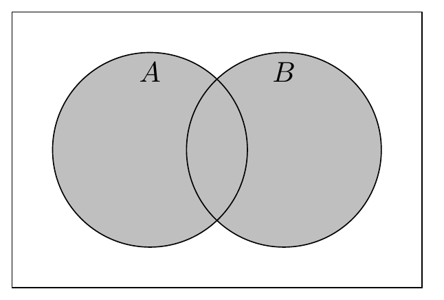{width="80%"}

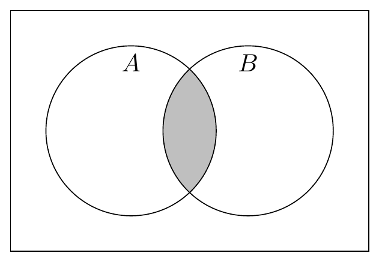{width="80%"}

Union and intersection of sets.
:::

For example, let $P$ be the set of presidents, and $Q$ be the set of vice presidents.
Because Barack Obama was president but not vice president, he belongs to the union of these sets, but not the intersection:
\begin{gather*}
\text{Barack Obama} \in P \cup Q, \\
\text{Barack Obama} \notin P \cap Q.
\end{gather*}
Naturally, more people have been president *or* vice president than have been both president *and* vice president.
In mathematical terms, the intersection $P \cap Q$ is a subset of the union $P \cup Q$.
This turns out to be a general property of sets, not just of American national officeholders.

::: {#prp-intersection-subset-union}
For any sets $A$ and $B,$

1. The intersection is a subset of each component set: $A \cap B \subseteq A$ and $A \cap B \subseteq B.$

2. Each component set is a subset of the union: $A \subseteq A \cup B$ and $B \subseteq A \cup B.$
:::

::: {#exr-union-intersection name="Unions and intersections"}
Consider the sets $X = \{1, 2, 4, 8\}$ and $Y = \{2, 4, 6, 8\}.$
Write out the elements of the intersection $X \cap Y$ and the union $X \cup Y.$
Then directly verify that the four claims made in @prp-intersection-subset-union hold for these sets.

:::: {.answer}
$$
\begin{aligned}
X \cap Y &= \{2, 4, 8\}. \\
X \cup Y &= \{1, 2, 4, 6, 8\}.
\end{aligned}
$$

Because $2 \in X,$ $4 \in X,$ and $8 \in X,$ we have $X \cap Y \subseteq X.$

Because $2 \in Y,$ $4 \in Y,$ and $8 \in Y,$ we have $X \cap Y \subseteq Y.$

Because $1 \in X \cup Y,$ $2 \in X \cup Y,$ $4 \in X \cup Y,$ and $8 \in X \cup Y,$ we have $X \subseteq X \cup Y.$

Because $2 \in X \cup Y,$ $4 \in X \cup Y,$ $6 \in X \cup Y,$ and $8 \in X \cup Y,$ we have $Y \subseteq X \cup Y.$
::::
:::

What if we wanted to talk about the set of people who have been president, but not vice president?
We can formulate this using the [set difference]{.concept definition="The set difference between $A$ and $B$, denoted $A \setminus B$, is the set of all elements that are in $A$ and are not in $B$."}.

::: {#def-set-difference name="Set difference"}
The [set difference]{.concept} between sets $A$ and $B$, denoted $A \setminus B$, is the set of elements that are in $A$ and not in $B$: $$A \setminus B = \{a \in A \mid a \notin B\}.$$
:::

::: {#fig-set-diff layout-ncol=2}
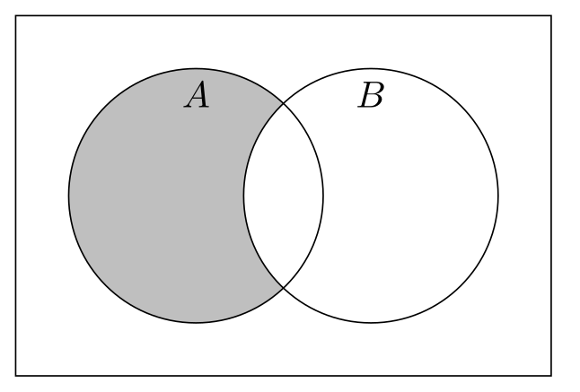{width="90%"}

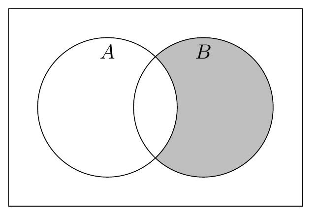{width="90%"}

Set differences.
:::

Joe Biden was both a vice president and a president.
Barack Obama was only president, never a vice president.
Aaron Burr was only vice president, never president.
Again let $P$ be the set of presidents and $Q$ be the set of vice presidents.
We have the following set memberships:

| Old guy      | $P$ | $Q$ | $P \cap Q$ | $P \cup Q$ | $P \setminus Q$ | $Q \setminus P$ |
|:-------------|:-------:|:-------:|:--------------:|:--------------:|:-------------------:|:-------------------:|
| Joe Biden    | x       | x       | x              | x              |                     |                     |
| Barack Obama | x       |         |                | x              | x                   |                     |
| Aaron Burr   |         | x       |                | x              |                     | x                   |

: {tbl-colwidths="[20,10,10,12,12,12,12,12]"}

::: {#exr-exclusive-or}
Using the union, intersection, and the set difference, find a way to denote the set of elements that are in exactly one of $A$ and $B$, but not both.

:::: {.answer}
$(A \cup B) \setminus (A \cap B)$.
::::
:::

No one who has been the president of the United States has also been the prime minister of the United Kingdom.
If we were to let $M$ denote the set of people who have been prime minister, then the intersection $P \cap M$ would be a set that contains ... nothing?
Yes, indeed, a set may contain nothing.
We have a special name for the set with nothing in it --- the [empty set]{.concept definition="The set containing no elements, denoted $\emptyset$."}.

::: {#def-empty-set name="Empty set"}
The [empty set]{.concept} is the set containing no elements, denoted $\emptyset$.
:::

Using this notation, a concise way to say "no one has been both the US president and the UK prime minister" would be $P \cap M = \emptyset$.
We say two sets are [disjoint]{.concept entry="Disjoint sets" definition="Two sets are disjoint if they have no elements in common, or equivalently if their intersection is the empty set."} when their intersection is empty.

Disjoint sets are important in probability, as you'll see in the stats sequence.
Imagine that there's a 30% chance that a kid is blonde, a 5% chance that they're a redhead, and a 10% chance that they're left-handed.
The probability of a blonde-or-left-handed kid is *not* necessarily 40% (i.e., 30% + 10%), because being blonde and being left-handed aren't disjoint: one kid could be both.
But because a kid cannot be both blonde and redheaded --- the intersection of the set of blonde kids and the set of redheaded kids is empty --- we can sum the individual probabilities to conclude that the probability of a blonde-or-redheaded kid is 35%.
If you're like me, you'll come to like it when events in probability turn out to be disjoint, as then you don't have to apply the finicky rules to avoid double-counting probabilities.

### Complements and De Morgan's laws {#sec-complements-de-morgans}

The set difference $A \setminus B$ is the set of everything in $A$ that's not in $B.$
But what if we simply wanted the set of *everything* that's not in $B?$
Once we can properly define this type of set, we will call it the [complement]{.concept definition="The complement of a set $A$, denoted $A^c$, is the set of all elements in the relevant universe that are not elements of $A$."} of $B$.

The one sticky mathematical issue is what we mean by "everything" that isn't in a set.
For example, again taking $P$ to be the set of people who have been the US president, it seems clear enough that Aaron Burr is in the complement of $P,$ as Aaron Burr was never the president.
So, in mathematical terms, we would like to say $$\text{Aaron Burr} \in \{x \mid x \notin P\}.$$
But would we say that the number 3 is also an element of this set?
What about the chemical formula H$_2$O or the human gene CNR1?
It's true that these also have never been the president, but it is hard to imagine that we would ever care to make that observation.

To have a useful working definition of "everything not in this set", we are going to assume there's a set $U$ that contains the [universe]{.concept definition="The set of everything that could conceivably be in the sets we're talking about.  The relevant universe is highly dependent on the specific context, and ought to be inferable from context clues if not explicitly stated."} of objects we might be interested in.
The appropriate choice of universal set depends on the context for what we want to do.
Most commonly, if we are talking about numbers that lie along the typical number line, our universal set might be the real line, $\mathbb{R}$.
Or if we are talking about who has and has not held particular political positions, our universal set might be the set of all people who have ever lived.

Once we have settled on the universe of objects we care about, it's simple to define the complement of a set.

::: {#def-complement}
## Complement
The [complement]{.concept} of the set $A$, denoted $A^c$, is the set of all elements in the universe that are not in $A$, i.e., $A^c = U \setminus A$.
:::

::: {#fig-complement layout-ncol=2}
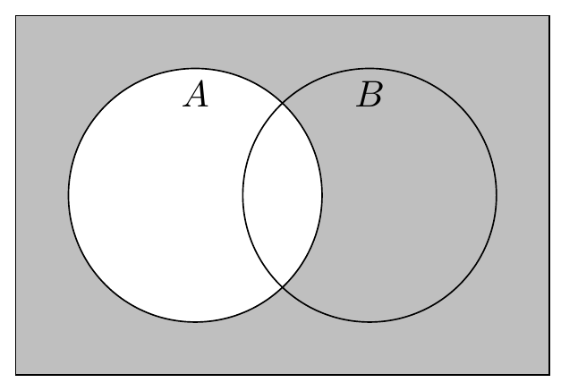{width="90%"}

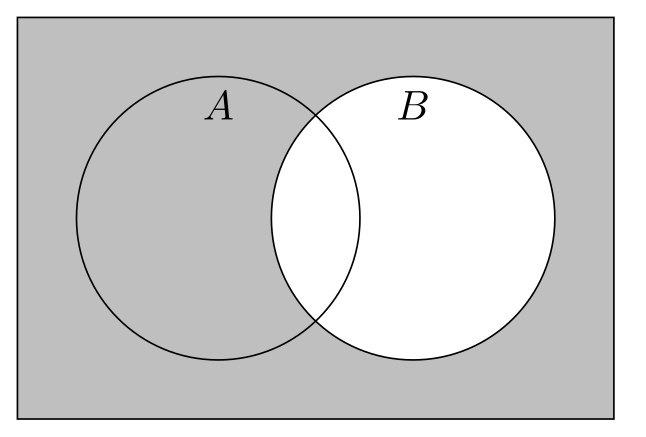{width="90%"}

Complements.
:::

You don't often see the universal set explicitly specified in mathematical writing, other than textbook set theory treatments like what you're reading right now.
So what do you do if you see someone talk about the complement of a set, without having specified the relevant universe?

- The appropriate "universe" should typically be clear from the context.
  For example, if every set being discussed consists exclusively of real numbers, then the relevant universe is most likely the entire number line: $U = \mathbb{R}.$

- In probability applications specifically, the "universe" is the set of all possible outcomes of the random process being considered.
  This set is called the "sample space" and is often denoted $\Omega.$

  For example, in the context of a survey of three people (A, B, C) who are asked whether they approve of the president's job performance (yes or no), the universe is the set of the eight possible combinations of responses:
  $$
  \Omega = \left\{
  \begin{gathered}
  \text{A: yes, B: yes, C: yes}, \quad \text{A: yes, B: yes, C: no}, \\
  \text{A: yes, B: no, C: yes}, \quad \text{A: yes, B: no, C: no}, \\
  \text{A: no, B: yes, C: yes}, \quad \text{A: no, B: yes, C: no}, \\
  \text{A: no, B: no, C: yes}, \quad \text{A: no, B: no, C: no}
  \end{gathered}
  \right\}.
  $$

- If the context is not clear enough for there to be a natural choice of universal set (e.g., you're talking about sets of radically different types of objects), then use explicit set differences when needed rather than taking complements of sets.

One brief note on notation.
Some textbooks and writers use an overline, as in $\overline{A}$, to denote the complement of a set.

::: {#exr-complement title="Complement of a set"}
Suppose our universe is the number line, $\mathbb{R}.$
Let $X = \{x \in \mathbb{R} \mid x < 10\}.$
Characterize $X^c.$

:::: {.answer}
$X^c = \{x \in \mathbb{R} \mid x \geq 10\}.$

Fun fact: we usually use the shorthand $(-\infty, a)$ to denote a set of the form $\{x \in \mathbb{R} \mid x < a\}.$
We also use the shorthand $[b, \infty)$ to denote a set of the form $\{x \in \mathbb{R} \mid x \geq b\}.$
Using these shorthands, we have $X = (-\infty, 10)$ and $X^c = [10, \infty).$

I'll leave it to you to infer what the shorthands $(-\infty, a]$ and $(b, \infty)$ stand for.
::::
:::

::: {#exr-complement-repeated title="Complement of the complement"}
Suppose our universe is the set of natural numbers from 1 to 10.
Let $X = \{2, 4, 6, 8, 10\}.$
Characterize $X^c$ and $(X^c)^c.$
Confirm that $(X^c)^c = X.$

**Bonus question to think about:** Is it generally true that the complement of the complement is the original set, or is that a special property of this example?

:::: {.answer}
We're working with the universe $$U = \{1, 2, 3, 4, 5, 6, 7, 8, 9, 10\}.$$
This gives us the complement $$X^c = U \setminus X = \{1, 3, 5, 7, 9\}.$$
The complement of the complement in turn is $$(X^c)^c = U \setminus X^c = \{2, 4, 6, 8, 10\},$$ which is indeed the same as the original set $X.$

The equality $(X^c)^c = X$ is not special to this example---it's a general property of the complement.
We'll see soon enough how to prove this claim formally.
For now, it'll suffice to observe that $(X^c)^c = \{x \in U \mid x \notin X^c\}.$
But if an element $x$ is *not* an element of the complement $X^c,$ then it must be an element of the original set $X.$
Hence $(X^c)^c = \{x \in U \mid x \in X\} = X.$
::::
:::

You can combine the complement with other set operations.
For example, $(A \cup B)^c$ is the complement of $A \cup B,$ i.e., everything that is not an element of $A \cup B.$
Be careful when combining operations in this way!
In general, it is *not* true that $(A \cup B)^c = A^c \cup B^c.$
In fact, the complement "flips" a union into an intersection, and vice versa---a property of the complement known as [De Morgan's laws]{.concept definition="Rules for taking the complement of a union or an intersection of sets.  The complement of a union is the intersection of the individual complements, and the complement of an intersection is the union of the individual complements."}.

::: {#thm-demorgan-sets name="De Morgan's laws"}
1. $(A \cup B)^c = A^c \cap B^c$.

2. $(A \cap B)^c = A^c \cup B^c$.
:::

::: {#fig-demorgan-sets layout-ncol=2}
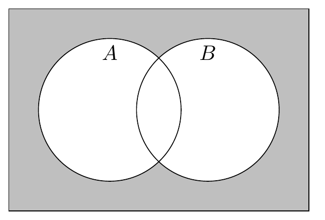{width="90%"}

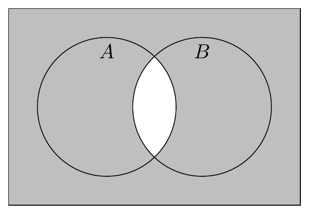{width="90%"}

De Morgan's laws.
:::

To illustrate De Morgan's laws, again let $P$ be the set of presidents and $Q$ be the set of vice presidents.
Their union, $P \cup Q,$ is anyone who's ever been president, vice president, or both.
The complement of the union, $(P \cup Q)^c,$ is therefore the set of people who have never been president *and* who have never been vice president.
In order to be in the complement $(P \cup Q)^c,$ a person must be in both the never-president set, $P^c,$ and the never-vice-president set, $Q^c.$
In other words, they must be in the intersection $P^c \cap Q^c.$

To think about it another way, let's see why $(P \cup Q)^c$ is *not* the same as $P^c \cup Q^c.$
Barack Obama was never vice president, i.e., $\text{Barack Obama} \notin Q,$ and thus $\text{Barack Obama} \in Q^c.$
Because he's in the complement of the vice president set, he's also in the union $P^c \cup Q^c.$
At the same time, because Barack Obama was the president, he's in the president set $P$---and thus also its union with the vice president set $P \cup Q.$
Altogether, we've shown that both of the following are true:
$$
\begin{aligned}
\text{Barack Obama} &\in P \cup Q; \\
\text{Barack Obama} &\in P^c \cup Q^c.
\end{aligned}
$$
Because these two sets have an element in common, namely Barack Obama, it cannot be the case that $P^c \cup Q^c$ is the complement of $P \cup Q.$

::: {#exr-de-morgan name="De Morgan's laws"}
Suppose our universe is the set of natural numbers from 1 to 10.
As in @exr-union-intersection, let $X = \{1, 2, 4, 8\}$ and $Y = \{2, 4, 6, 8\}.$
Directly confirm that both of De Morgan's laws apply to the union and intersection of these sets.

:::: {.answer}
Union and intersection (from the answer to @exr-union-intersection):
$$
\begin{aligned}
X \cap Y &= \{2, 4, 8\}; \\
X \cup Y &= \{1, 2, 4, 6, 8\}.
\end{aligned}
$$

Complements of the individual sets:
$$
\begin{aligned}
X^c &= \{3, 5, 6, 7, 9, 10\}; \\
Y^c &= \{1, 3, 5, 7, 9, 10\}.
\end{aligned}
$$

Confirmation of law 1:
$$
\begin{aligned}
(X \cup Y)^c &= \{1, 2, 4, 6, 8\}^c \\ &= \{3, 5, 7, 9, 10\}; \\
\end{aligned}
$$

Confirmation of law 2:
$$
\begin{aligned}
(X \cap Y)^c &= \{2, 4, 8\}^c \\ &= \{1, 3, 5, 6, 7, 9, 10\}; \\
X^c \cup Y^c &= \{3, 5, 6, 7, 9, 10\} \cup \{1, 3, 5, 7, 9, 10\} \\ &= \{1, 3, 5, 6, 7, 9, 10\}.
\end{aligned}
$$
::::
:::

## Functions {#sec-functions}

We often associate elements of one set with elements of another set.
We do this so often that it probably doesn't seem like math most of the time.

- Each graduate student is assigned to an office (including the carrels).
  You can think of this as a rule that takes each element of the set of Vanderbilt political science graduate students and associates it with an element of the set of rooms on the third floor of the Commons Center.

- Every home in Davidson County belongs to one of three congressional districts.
  You can think of this as a rule that takes each element of the set of Davidson County addresses and associates it with an element of $\{\text{TN-04}, \text{TN-06}, \text{TN-07}\}.$

- Every US president took office in their first term in some year: George Washington in 1789, Grover Cleveland in 1893, Barack Obama in 2009, and so on.
  You can think of this as a rule that takes each element of the set of US presidents and associates it with a natural number.^[This exercise is more complicated for polities that existed both before and after the common era, such as the Roman Empire.]

Each of these examples is a [function]{.concept definition="A rule that associates each element in one set (the domain) with a single element in another set (the codomain).  We write $f : A \to B$ to denote a function $f$ with domain $A$ and codomain $B$."}, which we might say "maps" one set into another.
The notation $f : A \to B$ is a bit of mathematical shorthand that means "$f$ is a rule that takes each element of $A$ and associates it with an element of $B.$"
For any element $a \in A$, we write $f(a)$ to stand for the element of $B$ that the function associates $a$ with.
When a function maps $A$ into $B$, we call $A$ the [domain]{.concept definition='The set that a function "acts on."  If $f$ is a function whose domain is $A,$ then $f(a)$ is defined for every element $a \in A.$'} and $B$ the [codomain]{.concept definition='The set that a function "maps into."  If $f$ is a function whose domain is $A$ and whose codomain is $B,$ then $f(a)$ is an element of $B$ for every element $a \in A.$'}.

To continue with the last example from the list above, let $y : P \to \mathbb{N}$ (verbally: "$y$ is a function that maps the set of presidents into the set of natural numbers") be the function that associates each president with the year they first took office.
Then we have $y(\text{George Washington}) = 1789,$ $y(\text{Grover Cleveland}) = 1893,$ and so on.
The domain of this function is the set of presidents, $P$, and the codomain is the set of natural numbers, $\mathbb{N}$.

Some associations between sets are not functions.
When we're thinking about the set of presidents, $P$, you might be tempted to think about a function that associates each president with their vice president.
However, no such function exists, for two reasons.

1. A function associates *every* element of its domain with an element of the codomain.
   However, some presidents had no vice president.
   For example, Andrew Johnson, who assumed the presidency after Abraham Lincoln's assassination, never had a vice president.

2. A function associates each element of the domain with *exactly one* element of the codomain.
   However, some presidents have had multiple vice presidents.
   For example, both Spiro Agnew and Gerald Ford served as vice president to Richard Nixon.

In mathematical terms, we would call the president-and-their-vice-president(s-if-any) assocation a [relation](https://en.wikipedia.org/wiki/Relation_(mathematics)).
Any function is a relation, but many relations are not functions.
There are lots of cool things to study about relations, but I cannot say in good faith that you *must* know these cool things, so that is all I will say about relations.

::: {#exr-pres-vp-functions name="Creating a valid function"}
Come up with a function that maps the set of presidents, $P$, into the set of vice presidents, $Q$.
Convince yourself that it satisfies the key requirement of a function --- that every element in $P$ is associated with one, and exactly one, element in $Q$.

:::: {.answer title="One answer"}
I propose the function $f : P \to Q$ defined so that $f(p) = \text{Joe Biden}$ for every president $p \in P$.
This rule associates every president with a vice president, so it is a function.

This might seem like a dumb example, but it meets the criteria that I set out, making it a valid answer.
Math is legalistic in this way: the question asked for a function $f : P \to Q$, I provided a function $f : P \to Q$, and therefore I got the answer right.
So if you're here in a political science PhD program because your law school dreams didn't quite work out, take comfort in knowing that you can still get to be a legalistic jackass when you're working in the world of math.
::::
:::

### One-to-one and onto functions

As you saw in my answer to @exr-pres-vp-functions, there is nothing in the definition of a function to suggest that every element of the domain must be associated with a *different* element of the codomain.
Some functions do have this additional property, and we call those functions [one-to-one]{.concept entry="One-to-one (aka injective)" definition="A function is one-to-one, also called injective, if it associates each element of the domain with a distinct element of the codomain: if $a \neq a'$, then $f(a) \neq f(a')$."}.

::: {#def-one-to-one name="One-to-one function"}
A function $f : A \to B$ is [one-to-one]{.concept entry="One-to-one (aka injective)"}, also called [injective]{.concept entry="One-to-one (aka injective)"}, if $f(a) \neq f(a')$ for all distinct elements $a \in A$ and $a' \in A.$
:::

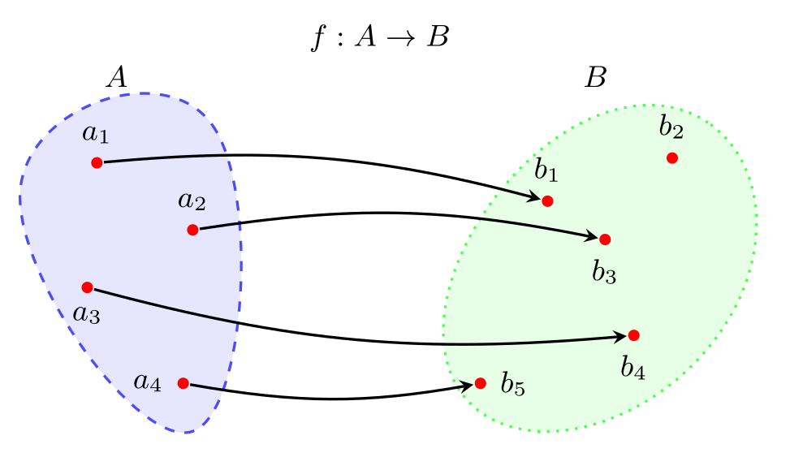{#fig-one-to-one fig-align="center" width="80%"}

The function $y : P \to \mathbb{N}$ that we discussed earlier, mapping presidents into the year that they first took office, is not one-to-one.
William Henry Harrison took office in March 1841, famously gave a lengthy speech in poor weather, caught cold, and died a month later.
His vice president, John Tyler, took office in April 1841.
In terms of the function we defined, $$y(\text{William Henry Harrison}) = y(\text{John Tyler}) = 1841.$$
Because these are two different presidents with the same function value, $y$ is not one-to-one.

You also saw in @exr-pres-vp-functions that a function need not reach every element of its codomain.
In fact, if the domain has fewer elements than the codomain --- such as with the sets of presidents $P$ and vice presidents $Q$, where at the time of writing there have been 45 presidents and 50 vice presidents --- it would be impossible for the function to reach every element of the codomain.
In the special case where a function does reach every element of the codomain, we turn a preposition into an adjective and say the function is [onto]{.concept entry="Onto (aka surjective)" definition="A function is onto, also called surjective, if it maps at least one element of the domain to every element of the codomain: for all $b$ in the codomain, there is a domain element $a$ such that $f(a) = b.$"}.

::: {#def-onto name="Onto function"}
A function $f : A \to B$ is [onto]{.concept entry="Onto (aka surjective)"}, also called [surjective]{.concept entry="Onto (aka surjective)"}, if for every element $b \in B$ there is some element $a \in A$ such that $f(a) = b.$
:::

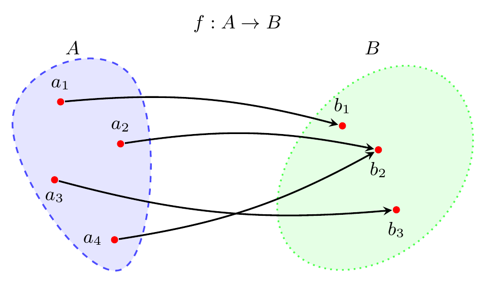{#fig-onto fig-align="center" width="80%"}

We have already seen that the function that maps presidents into the first year they took office is not one-to-one.
It is not onto either.
Consider 1999, the year *The Matrix* came out and inspired legions of nerds (like me...) to make green-on-black their default color theme for computing.
1999 is a natural number, or $1999 \in \mathbb{N}$ if you want to be formal about it, and yet no president took office for the first time then; Bill Clinton, who had first taken office in 1993, was the president the entire year.
We have found a number $n \in \mathbb{N}$ such that $y(p) \neq n$ for all presidents $p \in P$, meaning $y$ is not onto.

Functions that are both one-to-one and onto, which we call [bijections]{.concept entry="Bijection" definition="A function that is both one-to-one (injective) and onto (surjective)."}, are special.
What makes them special is that they can be reversed, or [inverted]{.concept entry="Inverse function" definition="The reverse of a function, denoted $f^{-1}$, where $f^{-1}(b) = a$ if and only if $f(a) = b$.  Only exists for bijections."} in the language of mathematics.
I like to think of a bijection as creating a "buddy system" between its domain and a codomain.
Think about a bijection $f$ that maps elements of (domain) $A$ into (codomain) $B$, so we'd write $f : A \to B$.
Then for every element $a$ of $A$, there is *exactly one* element $b$ of $B$ such that $f(a) = b$.
And for every element $b$ of $B$, there is *exactly one* element $a$ of $A$ such that $f(a) = b$.
If the function weren't one-to-one, then there'd be at least one $a \in A$ with multiple matches in $B$.
If it weren't onto, then there'd be at least one $b \in B$ with no matches in $A$.

::: {#def-bijective name="Bijection and inverse"}
A function $f : A \to B$ is a [bijection]{.concept} if it is both one-to-one and onto.

Every bijective function has an [inverse function]{.concept}, $f^{-1} : B \to A$.
For every pair of elements $a \in A$ and $b \in B$, we have $f^{-1}(b) = a$ if and only if $f(a) = b$.
:::

::: {#fig-bijection layout-nrow="2"}
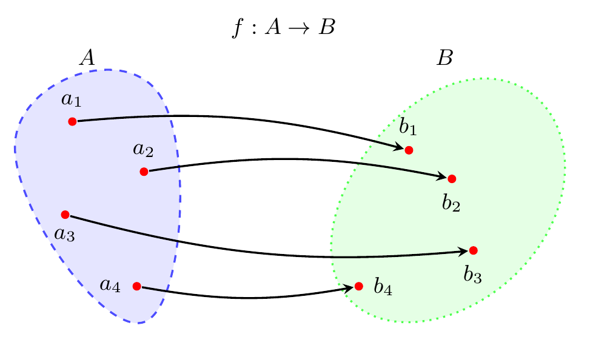{width="80%"}

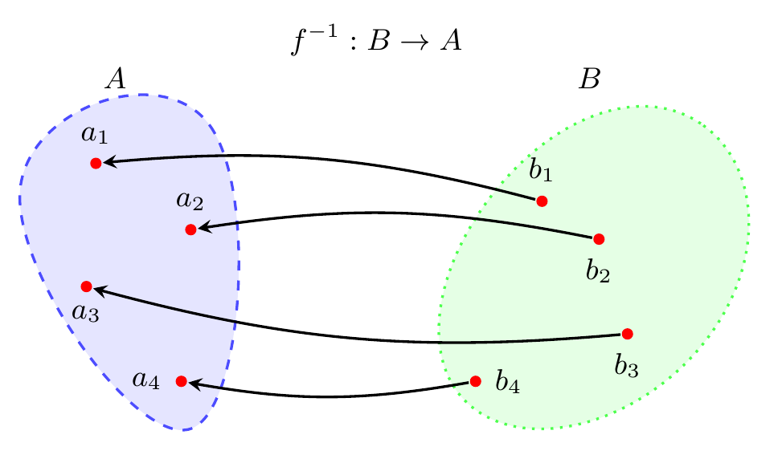{width="80%"}

A function that is both one-to-one and onto.
:::

@fig-bijection illustrates the buddy system property of a bijection.
Each element of $A$ has exactly one buddy in $B$, and each element of $B$ has exactly one buddy in $A$.
For finite sets like the ones in the illustration, you can probably convince yourself that they'd have to have the same number of elements in order for this kind of buddy system to be viable.
All I'll say here for infinite sets is that it gets weirder; read the optional @sec-cardinality below if you want to peek into the weirdness.

::: {#exr-function-properties name="One-to-one and onto"}
For each of the following functions, identify whether it is one-to-one, onto, both, or neither.
If the function is both one-to-one and onto, characterize its inverse function.

1. $f : \mathbb{N} \to \mathbb{N}$ defined by $f(n) = n + 1.$
2. $g : \mathbb{Z} \to \mathbb{Z}$ defined by $g(z) = z - 1.$
3. $h : \{8350\} \to \{8356\}$ defined by $h(8350) = 8356.$
4. $i : \{-1, 0, 1\} \to \{-1, 0, 1\}$ defined by $i(x) = x^2.$

:::: {.answer}
1. $f$ is one-to-one, as distinct inputs always map to distinct outputs.
   To be a bit more rigorous about this, we can show that $f(m) = f(n)$ can hold only when $m = n.$
   To see why that's the case, notice that $f(m) = f(n)$ means $m + 1 = n + 1,$ which in turn (after subtracting 1 from both sides) means $m = n.$

   $f$ is not onto.
   In particular, we have $1 \in \mathbb{N},$ yet there is no $n$ such that $f(n) = 1.$
   (The only input that could give us $f(n) = 1$ is $n = 0,$ but 0 is not an element of the domain we specified.)

2. $g$ is one-to-one.
   You can --- and should --- convince yourself of this by using the same logic as I used in my answer to #1.

   $g$ is also onto.
   To see why this is the case, we can take any element of the codomain and find the domain element that maps to it.
   Specifically, for any integer $y \in \mathbb{Z},$ the number $y + 1$ is an integer too (i.e., $y + 1 \in \mathbb{Z}$) and we have $g(y + 1) = (y + 1) - 1 = y.$

   The inverse function is $g^{-1} : \mathbb{Z} \to \mathbb{Z}$ defined by $g^{-1}(y) = y + 1.$
   To confirm that this is the inverse function, we must confirm that $g(g^{-1}(y)) = y$ for any arbitrary input $y:$ $$g(g^{-1}(y)) = g^{-1}(y) - 1 = (y + 1) - 1 = y.$$

3. $h$ is one-to-one.
   How can we draw that conclusion, given that there's only one element of the domain to begin with?
   Well, the only way for a function to *fail* to be one-to-one is for there to be two distinct elements of the domain that map to the same element of the codomain.
   Given that, any function whose domain is a [singleton]{.concept definition="A set that contains exactly one element."} --- a set with one element --- is one-to-one.

   $h$ is also onto: the only element of the codomain is 8356, and we have $h(8350) = 8356,$ so the whole codomain is covered by the function.

   The inverse function is $h^{-1} : \{8356\} \to \{8350\}$ defined by $h^{-1}(8356) = 8350.$

4. $i$ is not one-to-one: $i(-1) = i(1) = 1.$

   $i$ is not onto: we have $i(-1) = i(1) = 1$ and $i(0) = 0,$ so there is no $x$ in the domain that gives us $i(x) = -1.$
::::
:::

::: {#exr-function-properties-advanced name="More one-to-one and onto"}
Come up with an example of a function that is...

1. ... one-to-one, but not onto.
2. ... onto, but not one-to-one.
3. ... both one-to-one and onto.
4. ... neither one-to-one nor onto.

In each case, the domain and codomain of your function should both be the [unit interval]{.concept definition="The name for the set of real numbers from 0 to 1 inclusive, i.e., $[0, 1].$"}, $[0, 1].$

:::: {.answer}
There are, of course, many valid answers.
Here are some examples.

1. One-to-one but not onto: $f(x) = x/2.$
2. Onto but not one-to-one: the "hockey stick" function defined by $$f(x) = \begin{cases} 2x & \text{if $x \leq 1/2$},\\ 1 & \text{if $x > 1/2$}.\end{cases}$$
3. Both one-to-one and onto: $f(x) = x.$
4. Neither one-to-one nor onto: $f(x) = 0.$
::::
:::

### Composite functions {#sec-composite-functions}

Which political party controlled the White House on April 8, 1990?
To answer a question like this, I'd typically follow a two-step process:

1. Look up who was president on the specified day.
   (George H. W. Bush.)

2. Look up what party they belonged to.
   (Republican.)

Let's think about this process a bit more ... mathematically.
I'm constructing a function that maps from the set of days since April 30, 1789, which I'll call $D,$ into the set of all historical American political parties, which I'll call $T.$
To do this, I'm using the set of US presidents, which I'll continue to call $P,$ as a kind of middleman.
Specifically, I'm building the "which party held the White House on a particular day?" function out of two other functions involving the set of presidents:

- The "who was president on a specific day?" function, $g : D \to P.$
   Remember the meaning of this notation: $g$ is a function that maps $D$ (the set of days) into $P$ (the set of presidents).

- The "which party did a specific president belong to?" function, $h : P \to T.$

Now we can describe my two-step lookup process in a more mathematical way.
I'm constructing the "which party controlled the White House on a specified day" function, $f : D \to T.$
Given any day $d \in D,$ I calculate $f(d)$ by:

1. Looking up who was president on the specified day.
   In mathematical terms, I find $g(d).$

2. Looking up the party that's associated with the president I found in step 1.
   In mathematical terms, letting $p$ denote the result of the last step, so that $p = g(d),$ I find $h(p).$
   Or, even more concisely, I find $h(g(d)).$

Putting this all together, we see that $f(d)$ can be defined as $$f(d) = \overbrace{h(\underbrace{g(d)}_{\mathclap{\text{who was president on day d?}}})}^{\mathclap{\text{what party did g(d) belong to?}}}.$$
We call this sort of nested construction a composite function, or [composition]{.concept definition="A composition, or composite function, is a function of another function.  For functions $g : A \\to B$ and $h : B \\to C$ (note that the codomain of $g$ must be the same as the domain of $h$), the composition of $h$ and $g$ is the function $f : A \\to C$ defined by $f(a) = h(g(a))$ for all $a \\in A.$"}.

::: {#def-composition name="Composition of functions"}
For any functions $g : A \to B$ and $h : B \to C,$ the [composition]{.concept} of $h$ and $g$ is the function $f : A \to C$ defined by $$f(a) = h(g(a))$$ for all $a \in A.$

Notice that the codomain of the "inner" function $g$ must match the domain of the "outer" function $h.$

FYI, the composition of $h$ and $g$ is sometimes denoted $h \circ g$, though we won't use that notation in this course very often.
::: 

When we get to calculus, you'll see that we can often make things easier by treating a function as a composition.
For example, think of the function $f : \mathbb{R} \to \mathbb{R}$ defined by $$f(x) = (2x + 7)^4.$$
You can think of $f$ as the composition of $h : \mathbb{R} \to \mathbb{R}$ and $g : \mathbb{R} \to \mathbb{R}$ defined by
$$
\begin{aligned}
g(x) &= 2x + 7, \\
h(y) &= y^4.
\end{aligned}
$$
To see why, notice that for any real number $x,$
$$
h(g(x))
= h(2x + 7)
= (2x + 7)^4
= f(x).
$$
It will be easier to see why this is useful when we get to the chain rule (@prp-chain-rule).
When you come across a function whose derivative you can't tell how to take directly, it's often convenient to break it down into composite pieces whose derivative you *do* know how to take.

For now, let's just get some practice recognizing composite functions and breaking them down.

::: {#exr-compositions name="Composite functions"}
Break each function $f$ listed below into a composition of $h$ and $g$.
Make sure to specify the domain and codomain of each piece of the composition.

1. $f : S \to \mathbb{N}$, where $S$ is the set of US states, where $f(s)$ represents the age of the oldest member of the state's House delegation.

2. $f : \mathbb{R} \to \mathbb{R}$ defined by $f(x) = 2^{x^2 - 4x + 4}.$

3. $f : \mathbb{R} \to \mathbb{R}$ defined by $f(x) = x.$  (This is not a typo.  Figure out how to think of it as a composite function.)

:::: {.answer title="Answers"}
1. This is another example of the two-step reasoning process I outlined at the start of the section.
   Let $H$ be the set of House members, let $g : S \to H$ select the oldest House member in each state, and let $h : H \to \mathbb{N}$ give the age of each House member.
   Then we have $f(s) = h(g(s))$ for all $s \in S.$

2. Define $g : \mathbb{R} \to \mathbb{R}$ by $g(x) = x^2 - 4x + 4$ and $h : \mathbb{R} \to \mathbb{R}$ by $h(y) = 2^y.$
   Then we have
   $$
   h(g(x)) = h(x^2 - 4x + 4) = 2^{x^2 - 4x + 4} = f(x).
   $$

3. There are many valid answers here.
   One cheeky answer is to define $g : \mathbb{R} \to \mathbb{R}$ by $g(x) = x$ and $h : \mathbb{R} \to \mathbb{R}$ by $h(y) = y,$ so we have $$h(g(x)) = h(x) = x = f(x).$$
   You could also set $g(x) = x + 10$ and $h(y) = y - 10,$ giving you $$h(g(x)) = h(x + 10) = (x + 10) - 10 = x = f(x).$$
   Or perhaps $g(x) = c x$ and $h(y) = y / c$ for some constant $c \neq 0,$ resulting in $$h(g(x)) = h(c x) = \frac{c x}{c} = x = f(x).$$

   The lesson here is that there may be numerous different ways to break a function down into a composition of other functions.
   Make the choice that is most *convenient* for whatever you're trying to accomplish.
::::
::: 

### An optional digression into cardinality and infinities {#sec-cardinality}

This section contains material that is not strictly necessary, but which I find edifying and hope you will too.

The [cardinality]{.concept definition="The cardinality of a set $A$, denoted $|A|$, is the number of elements in the set if it is finite.  It gets more complicated if the set is infinite."} of a set, loosely speaking, is the number of elements in the set.
We write $|A|$ to denote the cardinality of a set $A.$
For a finite set, this loose definition is exact --- the cardinality of a finite set is simply its size.
For example, if $A = \{1, 10, 100\}$, then $|A| = 3$.

It gets more complicated once we start dealing with infinite sets.
You might think that $|A| = \infty$ for infinite sets.
But you would be wrong, because it turns out some infinities are bigger than others.
The goal of this section is to show you why.

First we need to define what it means for two sets to have the same cardinality.
With finite sets, this is simple --- they have the same number of elements.
To extend this to infinite sets, we will rely on bijections.
We will say that two sets have the same cardinality if we can set up a buddy system between the two of them.

::: {#def-equal-cardinality name="Equal cardinality"}
The sets $A$ and $B$ have the same cardinality, denoted $|A| = |B|$, if there is a bijective function that maps $A$ into $B$.
:::

It is obvious enough that this definition "works" for finite sets.
Consider the sets $A = \{\text{Coke}, \text{Pepsi}, \text{Mountain Dew}\}$ and $B = \{10, 17, 27\}$.
We know just from looking at these sets that $|A| = |B| = 3$.
To prove that the formal definition is satisfied, it's easy enough to produce a bijection between them, such as the function $f : A \to B$ defined by
$$
\begin{aligned}
f(\text{Coke}) &= 10, \\
f(\text{Pepsi}) &= 17, \\
f(\text{Mountain Dew}) &= 27.
\end{aligned}
$$

In a way, it is easier to prove that two sets have equal cardinality than to prove that they don't.
To prove that $|A| = |B|$, we just need to find one bijection between them.
But to prove that $|A| \neq |B|$, we need to show that *every* function between them is not a bijection.

Our definition of equal cardinality operates totally intuitively with finite sets.
It is not so intuitive with infinite sets.
Let $\mathbb{N}_E$ stand for the set of even natural numbers, so that $$\mathbb{N}_E = \{2n \mid n \in \mathbb{N}\} = \{2, 4, 6, \ldots\}.$$
It sure looks like $\mathbb{N}_E$ is "smaller" than $\mathbb{N}$.
After all, every even natural number is a natural number, yet not every natural number is an even natural number (for example, 1).
In mathematical notation, $\mathbb{N}_E \subseteq \mathbb{N}$ and $\mathbb{N} \nsubseteq \mathbb{N}_E$.
Nonetheless, these two sets turn out to have the same cardinality.

::: {#prp-cardinality-of-evens}
The set of even natural numbers, $\mathbb{N}_E,$ has the same cardinality as the set of all natural numbers, $\mathbb{N};$ i.e., $|\mathbb{N}_E| = |\mathbb{N}|.$
:::

::: {.proof}
We need to find a bijection between the two sets.
I propose the function $f : \mathbb{N} \to \mathbb{N}_E$ defined by $f(n) = 2n.$
This function is one-to-one, because the only way to have $f(n) = f(m)$ is to have $2n = 2m,$ which in turn can be true only if $n = m.$
This function is also onto, because every even natural number is 2 times some natural number (as is evident from the definition of $\mathbb{N}_E$ above).
Because $f$ is a bijection, we have $|\mathbb{N}| = |\mathbb{N}_E|.$
:::

{fig-align="center"}

This result is one hint at the weirdness of infinite sets.
A more vivid way to describe the weirdness is the metaphor of [Hilbert's Hotel](https://en.wikipedia.org/wiki/Hilbert%27s_paradox_of_the_Grand_Hotel).
Imagine a hotel with infinitely many rooms, one for each natural number.
A traveler arrives at the hotel, only to find out every room is full.
She starts to walk out the door, when the manager tells her, "Don't worry, we can make room."
He tells the occupant of room 1 to move to room 2, whose occupant goes to room 3, whose occupant goes to room 4, and so on, with the guest of each room $n$ being moved to room $n + 1.$
The new arrival can now move into room 1, even though the hotel was full when she arrived and no one has checked out.

If you buy that Hilbert's Hotel can accommodate one additional guest even when it's full, then you will probably agree that it could take any finite number of new guests.
If $m$ guests arrive, have the guest in each room $n$ move to room $n + m.$

What is more surprising is that Hilbert's Hotel can also accommodate an *infinite* number of new guests.
The logic is an application of @prp-cardinality-of-evens.
For each current guest in room $n,$ have them move to room $2n - 1.$
Now all of the even rooms are empty, and we can put the first new guest in our infinite sequence of new arrivals into room 2, the second into room 4, and so on.
This seems crazy.
It is crazy.^[We can make it even crazier if we want.  Suppose an infinite number of trains arrive, each of which contains an infinite number of guests.  Because [the set of all pairs of natural numbers has the same cardinality as the set of natural numbers](https://math.stackexchange.com/q/1293854), it turns out that the ostensibly full hotel can accommodate this infinity-upon-infinity of new guests too.]
Infinite quantities behave in strange ways, and we will go astray if we try to apply the rules of ordinary numbers to infinities.

We've seen that there are as many natural numbers as there are even natural numbers.
This result might lead you to think that all infinite sets have the same cardinality.
In fact, that's not the case.
Some infinities are bigger than others.
For example, the cardinality of the real numbers is greater than the cardinality of the natural numbers.^[Is there any set whose cardinality is in between these two?  Mathematicians literally, and famously, [cannot decide](https://en.wikipedia.org/wiki/Continuum_hypothesis).]

To see why there are more real numbers than natural numbers, we will sketch out [the diagonal argument](https://en.wikipedia.org/wiki/Cantor%27s_diagonal_argument) from the 19th century mathematician Georg Cantor.
(It's a sketch because there are some nagging details that we will ignore.  For example, we are ignoring the possibility of two different decimal expansions corresponding to the same number, as is the case with 0.1 and 0.099999$\cdots$.)
Remember that two sets have equal cardinality if there is a bijection that maps one into the other.
So to prove that the cardinalities of the natural numbers $\mathbb{N}$ and the real numbers $\mathbb{R}$ are different, we will show that no function $f : \mathbb{N} \to (0, 1)$ can be onto, and thus no bijection meeting the definition of equal cardinality may exist.

Take any function $f : \mathbb{N} \to (0, 1).$
This function associates each natural number $n = 1, 2, \ldots$ with a real number between 0 and 1 (not inclusive).
We want to show that there is a real number $x \in (0, 1)$ outside the range of $f,$ i.e., $f(n) \neq x$ for all $n \in \mathbb{N}.$
To see how we're going to do this, let's imagine lining up each $f(n)$ and taking their decimal expansion.

| $n$      | $f(n)$     | digit 1 | digit 2 | digit 3 | digit 4 | digit 5 | ... |
| -------- | ---------- | ------- | ------- | ------- | ------- | ------- | --- |
| 1        | 0.04052... | **0**   | 4       | 0       | 5       | 2       | ... |
| 2        | 0.65077... | 6       | **5**   | 0       | 7       | 7       | ... |
| 3        | 0.97986... | 9       | 7       | **9**   | 8       | 6       | ... |
| 4        | 0.57433... | 5       | 7       | 4       | **3**   | 3       | ... |
| 5        | 0.09802... | 0       | 9       | 8       | 0       | **2**   | ... |
| $\vdots$ | $\vdots$   |         |         |         |         |         |     |

We want to find an $x$ that is not equal to any $f(n)$.
We can construct this by ensuring that the $n$'th decimal of $x$ differs from the $n$'th decimal of each $f(n)$.

| $n$      | $f(n)$     | n'th digit of $f(n)$ | n'th digit of $x$ |
| -------- | ---------- | ---------------------- | ------------------- |
| 1        | 0.04052... | 0                      | 1                   |
| 2        | 0.65077... | 5                      | 6                   |
| 3        | 0.97986... | 9                      | 0                   |
| 4        | 0.57433... | 3                      | 4                   |
| 5        | 0.09802... | 2                      | 3                   |
| $\vdots$ | $\vdots$   | $\vdots$               | $\vdots$            |

By constructing $x$ this way, we ensure that there is no $n$ where $f(n)$ equals $x,$ because we know that it differs in at least one decimal place from every single $f(n).$
This means there is no onto function that maps from the natural numbers into $(0, 1)$, and therefore no onto function that maps from the natural numbers into the real numbers, and therefore these sets have different cardinalities.
In other words, there is more than one infinity! 

::: {#concept-review}
:::
